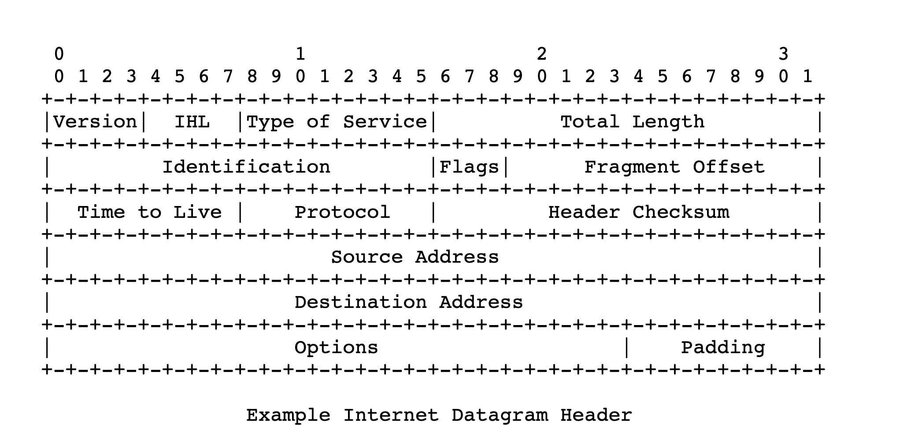
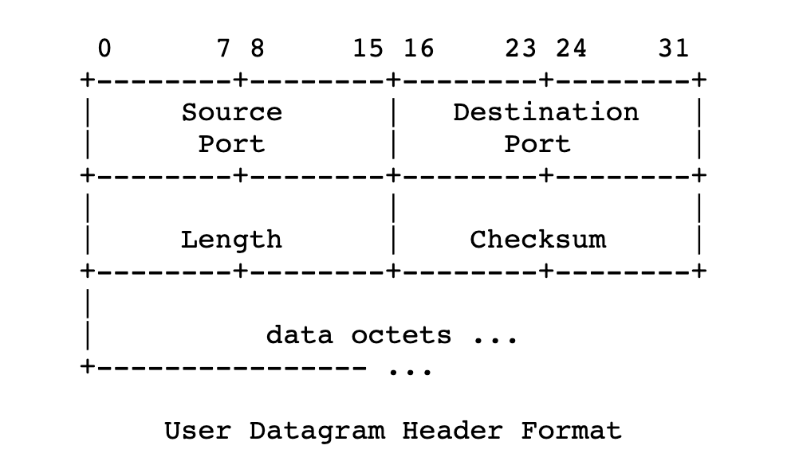

# CS144 Lec2

- gitk: UI for git

## Reliability

### Reliable retrieval a piece of data (get data)

- Datagram is an unreliable abstraction **(TCP/UDP Layer!)**
- How to build **reliable** abstraction on the top of datagram(unreliable): **Protocol**
  - client -> request -> server
  - client wait for xx time to get reply
    - if get reply -> done!
    - it time expires, no answer -> repeat send request
  - After yy times failed timeout, return an error to the user
- Abstraction: Client, Server,Request, Reply
- How to deal with " delivered but byte changed"?
  - Add some checkSum/ Redundant information: "The Sum of all byteds in my datagram == 57"
- Idemopotent/幂等的: It doesn't matter how many times the operation happens

#### Reliable action (Change data)

- Abstraction: **State**
- "Fire the first available torpedo" - is none-idemopotent
  - "Fire torpedo #3" - is idemopotent: has same result

- General Solution:
  - "My instruction #3 is xxxxxxx" - idemopotent
  - The server should remeber the number of instruction


### TCP

- How to send reliable byte stream

  - eg: ByteStream "ABCDEF"
  - index from 0, 1, 2, 3, 4, 5
  - The instructions will be: [lab 1,2,3,4]
    - "Byte indexs 0-2 is 'ABC' "
    - "Byte indexs 3-5 is 'DEF' "
    - "Byte stream finished at index #6" 

- RFC: request for comments

- Internet Datagram: [IP layer ? ] 
  
- 
  
  - IHL: Header Length
  - Internet Datagram: from program to program ?
  
- How to distinguish with datagram belongs to which application

  - protocol (1 byte)

  - Multiplexing. How to multiplexing? Using port number.

  - UDP: (Put in the "message" part of Internet Datagram) **[TCP layer]**

  - UDP: from program to program / Port number distinguishes diferent programs

  - 

    

  - ```C++
    // send message to port 12345
    UDPSocket sock;
    Address destination{"1.2.3.4", "12345"};
    sock.sendto(destination, "Hello");
    ```

  - ```C++
    // listen on port 12345
    UDPSocket sick;
    // 0.0.0.0 listen all the request from port 12345
    Address myaddress("0.0.0.0", "12345");  //port number 12345
    sock.bind(my_address);
    while(true){
    	auto income_datagram = sock.recv();
    	cout << income_datagram.source_address.to_string() << endl;
      //reply
      sock.sendto(income_datagram.source_address, "Thanks for your info!");
    }
    ```

    

- package and datagram
  When we're talking about a [datagram](https://en.wikipedia.org/wiki/Datagram), we're specifically talking about **connectionless** communication and an **unreliable** service over a packet-switched network. So, we refer to "IP datagrams" and UDP datagrams" -- neither IP nor UDP set up connections or guarantee reliability. 
