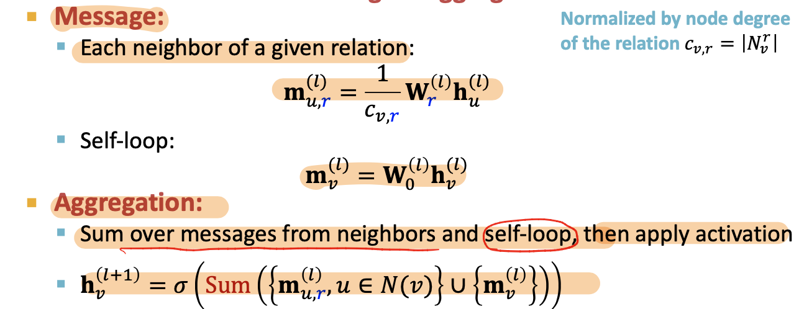

# CS224W Review

Pictures from: cs224w.stanford.edu

Not important: Lectures 1, 5, 9, 12, and 14.

Important: 2,4,6,7,8,10,11,13

Topic list (not exhaustive): 

- Centrality measures & PageRank
- ‼️GNN model & design space (message passing, aggregate, and combine) - core to build GNN
- knowledge graph embeddings, Query2Box, recommender systems(LightGCN), generative models

## Lec1: Intro

### Graph Intro

- picture: grid; NLP: sequences
- representation Learning: 
  - automatically learn the feature of graph
  - similar nodes in the graph are embedded close together
- Course Outline:
  - 

- Graph ML tasks
  - node classification
  - link prediction
  - Graph classification
  - Clustering
- Edge-level task:
  - recommender system
    - node: user, items
    - edge: user-item interactions
  - PinSage:
    - Node ???, edge ???
  - Drug Side Effect: given a pair of drugs predict adverse side effects
    - Node: drugs and proteins
    - Edges: Interactions (different type edge, different side effect)

- Graph level task:
  - Drug discovery: node-atoms; edges: chemical bonds
  - physical simulation

- Graph Types:
  - directed & undirected graphs
    - directed graph node **average degree**: The (total) degree of a node is the sum of in- and out-degrees.
  - heterogeneous graphs: different types of node and edge
  - Biparitie graph:
    - Folded networks: biparitie graph => projection
  - weighted / un-weighted
  - self-edges
  - Multigraph: multi-edges between two nodes

- adjacent matrix / Adjacent list
- Connectivity
  - conneted graph
    - unconnected-graph: adjacency matrix is **block diagonal** 
  - Strongly connected directed graph
    - every node A, B, exist a path from A-B and B-A
  - Weakly connected directed graph

## Lec2: Traditional ML

### Traditional Methods for Graph ML

- Traditional ML pipeline uses hand-designed features

- node level: $f:V\rarr R$

#### node level features

- Node degree

- Node centrality: takes node importance in a graph into account

  - eigenvector centrality
    - 
    - $\lambda c = Ac$
    - centralitiy $c$ is eigenvector of $A$,use largest eigenvalue$\lambda_{max}$ and the corresponding $c_{max}$
  - Betweenness centrality
    - A node is important if it lies on **many shortest paths** between other nodes.
    - 
    - at least 3 hop path ???
  - Closeness centrality
    

- Clustering coefficient

  - counts \#(triangles)
  - 

- Graphlets:

  - Rooted connected induced non-isomorphic subgraphs
  - small subgraphs describe the structure of node $u$'s neighborhood
  - GDV: graph degree vector
    - \#(graphlets) a node touches

  - induced Subgraph: all the edges an
  - isomorphism: same number of nodes; bijective mapping
  - 

- important based features: predict influential nodes in a graph
- Structure-based features: predict role a node plays 

#### link prediction task and features

- key: design features for a pair of nodes

- link prediction task:
  - links missing at random
  - links over time
- link prediction methodology:
  - for **each pair (x,y)**, compute score $c(x,y)$
- Link-level features
  - distance based featrue
    - shortest-path distance between two nodes
  - local neighborhood overlap
    - 
    - limitation: metric is always zero if the two nodes do not have any neighbots in common
  - global neighborhood overlap
    -  $p^{(K)} = A^K$(length K)
    -  use $A_{uv}^l$ = \#walks of length l
    -  Katz index: number of walks of alll lengths between a given pair of nodes.
       
    -  $S_{ij}$, score for node pair $(i, j)$

### Graph-level Features

- kernel methods

  - design kernels instead of feature vectors
  - $K = (K(G,G'))_{G,G'}$ semidefinite
  - $K(G,G') = \phi(G)^T\phi(G')$, $\phi$ is a feature representation (Graph feature vector)
  - **Bag-of-Words** for a graph

- Graphlet Kernel

  - Graphlet (different definition): not need to be connected; not rooted
    

  - normalize
    

- Weisfeiler-Lehman Kernel
  - use neighborhood structure to iteratively enrich node vocabulary
  - Color Refinement
    - HASH function:(current node, neighbor nodes)
    - 
    - total time complexity is linear in #(edges)

## Lec3: Representation Learning

### Node Embeddings

- Graph Representation Learning
  - task-independent feature learning for machine leanring with Graphs

#### Encoder and Decoder

- Goal: similarity in the embedding space (e.g., dot product) pproximates similarity in the graph

- Three important things need to define: 

  - similarity
    - a measure of similarity in the original network
    - $ similarity(u,v) \approx z_u^Tz_v $
  - Encoder
    - nodes to embeddings
  - Decoder
    - map from **embeddings** to the **similarity score**; 
    - Decoder based on node similarity
    - maximize $z_v^Tz_u$ for (u,v) who are similar
      - how to define similar?

  - 

- shallow encoding
  - $ENC(v) = z_v = Z \cdot v$
  - $Z$ is the matrix to optimize; v is indicator vector(all zeroes except a one in column indicating node v)
  - encoder is just a **embedding-lookup**
  - Shallow: each node is assigned a unique embedding vector
    - directly optimize the embedding of each node
  - Substitue method/Deep encoders(GNNs): DeepWalk, node2vec ????

- key: define node similarity (can use )
- Unsupervised/self-supervised learning embeddings

#### Random Walk Approches for node Embeddings

- Random Walk => define node similarity (Decoder)

- Probability $P(v|z_u)$: predicted probability of visiting node $v$ on random wals starting from node $u$
  - $z_u$ is the embedding of node $u$, our target
  - Non-linear functions used to produce predicted P
    - Softmax: turn K real values into K probabilities that sum to 1
    - Sigmoid

- Random walk:

  - Is it a definiation of similarity

  - If $u$ and $v$ co-occur on a random walk, $(u,v)$ is similar; high-order multi-hop information
    - incorporates both local and high-order neighborhood information
  - $ z_u^Tz_v \approx$ the probability that u and v co-appear on a random walk
  - steps:
    - use random walk to get $P(v|z_u)$
    - optimize embedding to encode the  $P(v|z_u)$

- Unsupervised Feature Learning

  - Learn node embedding such that **nearby** nodes are close together in the network
    - nearby: random walk co-occurrance
    - nearby nodes: neighborhood of $u$ obtained by some random walk strategy $R$
  - As Optimization - Random Walk Optimization
    - 
    - Steps:
      - run short fixed-length random walks
      - get multiset of nodes visited on random walks starting from $u$
      - Optimize embeddings according to predicted neighbors $N_R(u)$

- Optimization target of random walk

  - 
  - 
  - 
  - 
  - Negtive sampling to approximate
    - k random negtive samples
      
    - Stochastic Gradient Descent: evaluate it for each **individual** training example

- How random walk
  - Deepwalk: fixed-length, unbiased
  - node2vec: biased 2nd order random walk $R$

- Node2vec: Biased Random walk

  - trade off between **local** and **global** views
  - BFS, DFS
  - return parameters $p$: return to where it comes
  - in-out parameters $q$: ratio of BFS vs. DFS
    - 

  - BFS like: low $p$ ; DFS: low $q$

### Embedding Entire Graphs

- Approach1: sum $z_v$

- Approach2: create a virtual node, and connect the node with **each/every node** in subgraph/total graph

- Approch3: Anonymous Walk

  - 
  - **States** in **anonymous walks** correspond to the index of the **first time** we visited the node
  - Represent the graph as a probability distribution over these walks.

- **Approach 3:** **Anonymous Walk Embeddings**

  - Idea 1: Sample the anon. walks and represent the graph as fraction of times each anon walk occurs.

  - Idea 2: Learn graph embedding together with anonymous walk embeddings.

## Lec4: Graph as Matrix

Outline:

- Determine **node importance** via **random walk** **(PageRank)** 
  - stochastic matrix M
- Obtain node embeddings via **matrix factorization (MF)** 
  - $A- Z^TZ$
- View other **node embeddings** (e.g. Node2Vec) as MF

### PageRank

- flow model:
  - If page i with importance $r_i$ has $d_i$ out-links, each link gets $r_i / d_i
    $ votes

- Stochastic adjacency matrix M (column stochastic)

  - ‼️ ji not ij
    
  - flow equation: r=Mr
    - $r_j = \sum_{i\rarr j}r_i/d_i$

  - stationary distribution
    - $p(t+1) = M \cdot p(t) = p(t)$
    - rank vector $r$ is an eigenvector of the column stochastic matrix $M$ (with eigenvalue 1)

- Solve PageRank

  - **Power iteration**:
    
  - Use last iteration value?

  - problems:
    - Dead ends;
      - Solution: teleport with prob. $1-\beta$
      - **Dead ends ,with prob. 1.0 teleport**
    - Spider traps: spider traps absorb all importance

- PageRank
  - each step:
    - with prob. $\beta$, follow a link at random
    - 
    - 
    - 

### Random walk with restarts and PPR

- PPR: Personalized PageRank
  - Ranks proximity of nodes to the teleport nodes $S$ (start nodes)
    - eg, recommend related items to item Q, teleport could be {Q}
    - 
- PageRank: teleport to any node, same probability
  - Personalized PageRank: different landing probability of each node
  - Random walk with restarts: always to the same node
- Random walk is to get the teleport nodes $S$

### Matrix Factorization

- Matrix Factorization:
  - get node embedings
  - shallow embedding, ENC(v) = $z_v$;
  - **similarity: node u, v are similar if they are connected by an edge**
  - $ A=Z^TZ$ is generally not possible
    - learn $Z$ approximately
    - opptimize L2 norm $min_Z || A-Z^TZ ||_2$

- DeepWalk and node2vec have more complex node similarity - different complex matrix

- limitations of MF and random walk
  - Cannot obtain embeddings for nodes not in the training set
  - Cannot capture **structural similarity**
    - DeepWalk and node2vec do not capture structural similarity
  - Cannot utilize node, edge and graph
    -  DeepWalk/node2vec embeddings do not incorporate node features

- node embeddings based on random walks can be expressed as matrix factorization.

## Lec5: Node Classification

Message Passing & Node classificaiton

- not represent learning

- collecitve classification: **assigning labels to all the nodes in a network together**
  - correlations: homophily, influence

- Methods:
  - Relational classification
  - Iterative classification
  - Correct & Smooth

### Relational Classification

- idea: Propagate node labels across the network

- steps:
  - initialize unlabeled nodes $Y_v = 0.5$
- Let  $P_{Y_i} = P(Y_i=1) $ the posibility that node Yi belongs to class 1
  - Update each node one by one (use the new $P(Y_i)$)
    

  - Limits:
    - convergence is not guaranteed (use a maximum number of iterations)
    - Model cannot use node feature information

### Iterative Classification

- relational classifier does not use node attributes
- iterative classifier:  attributes and labels
- 
- 
- $z_v$ could be:
  - histogram of the number/fraction of each label in $N_v$
  - most common label in $N_v$
  - Number of different labels in $N_v$
  - $z_{v}$ could base on neighbors's label or neighbors' features
  - $z_v$ could be incomplelete
    - could use  -1 to denote
    - If use $\phi_1$ predict label, it wil bring wrong information to $z_v$. We do not want $z_v$ to have wrong information.
- Only use $\phi_1$  to initialize, and use $ \phi_2(f)$ to iterate (to update $z_v$ )

### Correct & Smooth

1. Train base predictor(Liner Model or MLP)
2. Use the base predictor to predict soft labels of all nodes.
3. **Post-process the predictions using graph structure** to obtain the final predictions of all nodes.(correct + smooth)

- step 1&2 = $\phi_1$
- Correct step:
  - Diffuse traingin error: same like pageRank/ Flow formulation
  - $\widetilde{A}$ like a random walk distribute matrix
  - $\widetilde{A}$ diffusion matrix : 
    - A: adjacency matrix + self loop
    - D = diag(d1, d2,.., dn)
  - 
- Smooth Step
  - 
  - Smoothen the prediction of the base predictor (smoothen prediction with neighbors)
- Examples
  - 

- diffusion matrix $\widetilde{A}$:
  - all the eigenvalues $\lambda$ are in [-1, 1]
  - $\lambda=1$ , eigenvector is $D^{1/2}1$
  - 

## Lec6 GNN

Graph neural Networks (Deep graph Encoders)

ENC(v) = GNN, can be combined with node similarity functions in Lec3

### Basics of Deep Learning

ML = optimization

- Supervised Learning: (today's setup) input $x$, label $y$
- taget : $min_{\theta}  L(y,f(x))$
- Loss function: L2 function
  - Don't care about the value of L, only care about $\Theta$ (variable parameters)

- Loss function Example: Cross Entropy(CE)
  - the lower the loss, the closer the prediction is to one-hot
- Gradient vector/ Gradient Descent
  - $\Theta = \Theta - \eta\nabla_{\Theta}{L}$
  - Gradient Descent is slow: need to calculate the entire dataset
- SGD: Stochastic Gradient Descent
  - Minibatch
  - Concepts: batch size; Iteration(on mini batch); Epoch(on the entire dataset)
  - SGD is unbiased estimator of full gradient

- Back Propagation
  - predefined building block functions $g()$
  - each such 𝑔 we also have its derivative 𝑔′
  - chain rule:
    
  - Hidden Layer
  - Forward propagation
- Non-linearity
  - ReLU
  - Sigmoid
- MLP(Multi-layer Perceptron)
  - bias vector can be write into $W_l$: add a dimision of $x$, always be 1

### Deep learning for graphs

- A naive Apporach: use adjacent matrix

  - limitation: 
    - too many parameters
    - different size of graph
    - sensitive ot node ordering

- Convolutional Networks

- For graph,  **Permutation Invariance**

  - Different order plan, same result of $f(A_i, X_i)=f(A_j, X_j)$
  - target: learn $f$ who is permuation invariance
  - $X_i$  node feature

  - $f$ : permutation equivariance function

  - GNN consist of multiple permutation equivariant / invariant functions

  - Equivariance and Invariance has a little difference

### Graph Convolutional Networks

- **Output**: Node embeddings/ subgraph embeddings/ graph embeddings

- Node takes information from it's neighbors
- Node's computation graph:
  - every node defines a different computation graph 
- Deep Model: Many Layers
  - **a node can appear in multiple places**

#### Neighborhood Aggregation

- Basic approach: average neighbor messages and apply a nerual network
  

- $W_k$ and $B_k$ is related to layer number
- Loss function:
  - Parameters: $W_k, B_k$
  - Assume: parameter sharing ??? (maybe sharing $W_k, B_k$)
  - rewrite  into matrix formulation
    
  - $\widetilde{A}$ is sparse
- Unsupervised Training
  - use **network similarity** to provide loss function / as the supervision
  - Similar nodes have similar embeddings: **Random walk, matrix factorization, node proximity**
  - 
- Supervised Training
  - Use loss function like CE
    
  - Steps:
    - define a neigghborhood aggregation function
    - Define a loss function on the embeddings
    - Train on a set of nodes, i.e., a batch of compute graphs
    - Generate embeddings for nodes as needed
  - shared parameters
- Inductive Capability
  - Train on a graph A and collected data about organism B
  - Train on part of nodes, generated node embedings on different nodes(never trained with)
    - Because the $W_k, B_k$ is shared
    - Create computational graph of a new node
    - forward 

- Difference of CNN and GNN
  - CNN is not permutational equivariant
  - 
  - Learn different $W_l^u$ for different neighbor $u$ of pixel $v$

## Lec7 General Perspective of GNN

Building blocks of GNN: 

- message
- aggregation
- Layer connectivity
- Graph augmentation
- learning objective
  

### A single layer of GNN 

message + aggregate

- message:

  - 

- Aggregation:

  - 

- `aggregate()` is only for neighbors, can ignore self-loop 

- 

- GCN: classical GNN layer

  - 

- GraphSAGE:

  - 
  - Two stage aggregation
    - aggregate neighbors 
    - aggregate over node itself
  - $AGG()$ can be what? (In paper, different kinds of AGG), has to be differentiable
    - Mean
    - Pool 
    - LSTM
  - L2 normalization: to every layer
    - 

- GAT

  - In GCN,  $\alpha$ is 1/degree_v,

  - GAT: make $\alpha_{uv}$ learnable

    - compute attention coefficients:

      

    - Nomorlize $e_{uv}$ using softmax

    - What is a()?

      -  eg, a single layer NN
      -  
      -  The parameters are jointly learned

    - Multi-head attention: output are aggregated(concat or sum)

- Batch Normalization

- Dropout:

  - use in linear layer of message function

- Activation function/non linear

### Stack GNN layers

- over-smoothing
  - shared neighbors grow quickly
  - adding more GNN layers do not always help

- Expressive power of shallow GNN
  - Increase the layers in message & aggregation
  - Add layers that do not pass messages
  - Add skip connections
    - 

### Graph Manipulation Approaches

- Graph Freature manipulation

  - feature augmentation
    - assign constant node feature
    - assign one-hot node feature
    - Add traditional node feature/embedding

- Graph Structure manipulation

  - too **sparse**: add virtual nodes/edges

    - add virtual edges: use $A+A^2$ instead of $A$, use bipartite graphs
    - add virtual nodes: connect every node in graph

  - too dense: sample neighbors when message passing

    - differ from drop out?
      - neighborhood sampling is not random. Drop out is random ? 
      - drop out is for training; neighborhood sampling is for both training and testing
    - Neighorhood sampling is not random sample
      - but use random sampling to pick the most important neighbors
      - sort the neighbors with visit count and pick top k

    

  - too large: sample subgraph to comput embeddings

## Lec8 Prediction

### Prediction with GNNs

- input graph => GNN => node embeddings => **prediction head**

  - different task levels require different prediction heads

- node level:

  - directly make prediction using node embeddings

- edge-level prediction $Head_{edge}(h_u^{(L)}, h_v^{(L)})$

  - Head_edge could be: 

    - concatenation + linear

    - dot product (only for 1-way prediction)

    - dot product for k-way prediction

      

- Graph-level 

  - similar to AGG() in a GNN layer
  - Head_graph could be:
    - global mean pooling
    - global max pooling
    - global sum pooling
  - global pooling will **lost information**

- Hierarchical Global Pooling

  - DiffPool
    - GNN A: compute embeddings
    - GNN B: compute the cluster taht a node belongs to

### GNN training

- supervised / unsupervised
- classification / regression
  - classification loss: cross Entropy
  - Regression loss: MSE loss

- Metrics for Binary Classification:
  - Accuracy
  - Precision
  - Recall 
  - F1-score
- ROC curve/ROC AUC

### Setting-up GNN prediction Tasks

- dataset split:
  - Training seg
  - validation set
  - test set
- Solutions:
  - Transductive setting: input graph can be observed  in all the dataset;
    - only split the node labels
    - **only comput loss on part of nodes**
  - Inductive setting: break the edges

- Link Prediction task:
  - We need to **create the labels** and **dataset splits** on our own
  - **hide some edges from the GNN**
  - Assign 2 types of edges in the original graph
    - message ages for message passing
    - supervision edges, take away, not the input to GNN
      - calculate the loss on supervision edges
  - Transductive
    - 4 types of edges
    - 
    - (1) => (2) => (3) view as time passing, it's very natural

## Lec9 GNN Expressiveness

- GCN(mean-pool): Element-wise mean pooling + linear + ReLU non-linearity
  - GNN caputres local neighborhood structures using computational graph
  - GNN only see node features in computational graph
  - Can not distinguish:
    - same computational graph
    - same node feature
- GraphSAGE(max-pool)

- injective function: most expressive GNN model should map subtrees to the node embeddings injectively
  - the most expressive GNN use injective function
  - GNN can fully distinguish different subtree structures if **every step of its neighbor aggregation is injective**
  - expressiveness depends on neighborhodd aggregation function
    - GCN(element-wise mean-pool)
    - GraphSAGE(element-wise max-pool)

- Design injective function using neural network
  - 
  - use multi layer perceptron to approximate $\Phi, f$
  - GIN(Graph Isomorphism Network):
    - GIN uses a neural network to model the injective HASH function of WL kernel
    - key is to use elment-wise sum pooling, not max/mean
  - 

 ## Lec10 KG Completion

- KG: l=0 is not a problem, h=t is a problem. h and t are not distinguishable

### Heterogeneous Graph

- multiple edges types and multiple node types
- $ G =(V, E, R, T)$

- extend GCN to handle heterogeneous graph

### Relational GCN

- aggragate using different relation type
- color = different relation type
- 

  - over all the relation type, over all the neighbors
  - Message:each neighbor of a given relation + self-loop
  - Aggregation: Sum over messages from neighbors and self-loop, then apply activation
  - 
- Scalability: (L layers of the computational graph)

  - Each relation has L matices: $W_r^{(1)},W_r^{(2)}...W_r^{(L)}$
  - A lot of parameters -> overfitting issue
  - Two methods to regularize the weights $W_r^{(l)}$ [avoid **too much parameters and overfitting**]
    - use block diagonal matirces 
    - Basis / Dictionary learning
- Block Diagnoal Matrices

  - make the weights **sparse**

  - **B low dimensional-matrices**, then # param reduces from $d^{(l+1)} \times d^{(l)}$ to $B \times \frac{d^{(l+1)}}B \times \frac{d^{(l)}} B$
- Basis Learning:

  - Share weights across different relations
  - $W_r = \sum_{b=1}^B a_{rb} \cdot V_B$ , a_rb is for each relation, and V_b is shared for all relations
    - only needs to learn $\{a_{rb}\}_{b=1}^B$
    - only need to learn B scalars
  - B group of similar relations, within a group, the relation share $V_B$
- Eg, node classification with RGCN
  - use the representation of the final layer $h_A^{(L)} \in R^k$ represent the probability of that class
- Eg: link predicition with RGCN, what kind of relation 
  - (E,r3,A), input is the final layer of E and A,
  - use a relation-specific score function
  - use negive sampling
  - Training supervision edge / Traning message edges
    - 
  - negtive edge: actually does not exsit
    - not belongs to exsiting edges
    - exsiting edges = training message edges & training supervision edges
    - Maximize the score of training supervision edge
    - Minimize the score of negtive edges
  - **validation edge: not visible when training**
  - training message edges & training supervision edges: all existing edges
  - Evaluation:
    - 
  - Metrics:
    - Hits@k
    - Reciprocal Rank
  - Become a **ranking** problem

### Knowledge Graphs Completion

- common knowledge graph database missing many true edges -> KG completion
- Task: For a given (**head**, **relation**), we predict missing **tails**
- Edges in KG are triples (h, r, t)
- Model entities and relations in the embedding/vector space $R^d$.
- Given a true triple (h, 𝑟, 𝑡), the goal is that the embedding of (h, 𝑟) **should be close** to the embeding of t
- Method: shallow embedding [Not training a GNN]
  - GNN is not used with shallow embeddings

####TransE

- **vector sum** : $h+r \approx t$
- the score of $d(h+l,  t)$ should be greater than the some random negtive edges

##### Connectivity Pattern

- Symmetry relation
- Inverse  relation
- Composition/ Transitive Relations
- 1-to-N relations
- TransE can not model: symmetric relations & 1-to-N relations[‼️reasons]

#### TransR

- design a new space for each relation and do translation in relation-specific space
- $M_r$: projection matrix for relation r
- r(h,t) / (h,r,t) => $M_rh + r = M_rt$
- TransR can not model composition relations [‼️reasons]
  - each relation has a different spaces, can not map back

#### DisMult

- bilinear modeling
- dot product

- **Scorefunc**:$f_r(h,t) = <𝐡,𝐫,𝐭> =∑_i𝐡_i ⋅𝐫_i ⋅𝐭_i$

- cannot model antisymmetric relations & inverse relations & composition relations

#### ComplEx

- embeds entities and relations in Complex vector space
- conjugate: ??
- ComplEx can model: antisymmetric, symmetric, inverse, 1-N
- can not model: composition

#### Summary

- 

- These methods can not model **hierarchical** relations
- Difference: how they are thinking the geometry of the relation, and how to move around in the space
- people don't combine shallow embedding with neural network

## Lec11 Reasoning over KGs

- multi-hop query
- difficulty: the **KG is incomplete** and unknown, missing relations;
  - completed KG is dense graph
  - so implicitly impute and account for the incomplete KG
    - Two ways:
      - Embedding query into a single point (like TransE)
      - Embed query into a hyper-rectangle(**box**)

### Predictive Query

- Types:
  - one-hop-query: 
    - find the tail
    - (e:Fulvestrant, (r:Causes))
  - Path query: (e:Fulvestrant, (r:Causes, r:Assoc))
    - 
    - Query plan of path queries is a chain
    - Traverse the graph
    - ouput: a set f nodes
  - Conjunctive Query: ((e:BreastCancer, (r:TreatedBy)), (e:Migraine, (r:CausedBy))
    - start from 2 entity
  - KG Completion <-> One -hop query

- Difficulty: KG is incomplete and unknow
  - completed KG is a dense graph, time complex
  - traversal problem -> prediction task
- Task: answer path-based queries over an incomplete knowledge graph
  - generalization of the link prediction
- Hypergraph: a link connects a lots of nodes

### Answering predictive queries

- Map graph & query into embeding space 
  - answer are node close to query
- Idea 1: Traversing KG in vecotr Space
  - generalize TransE
  - $q = h + r$ (r: learned relationship embedding)
  - $F_q(t) = -|| q-t||$
  - t: potential tail
  - Multi-hop: $q = v_a + r_1 + \dots + r_n$
  - TransE can not model 1-to-n relatiosn, so Query2box can not handle 1-to-N
  - TransE can handle composititonal relations
- Can we answer logic conjuction operation
  - set intersection
  - 
  - gray node in the picture is a set of entities
- Idea2: Query2Box

### Query2Box

query -> box

- intersection of 2 boxes is a box
  - **Things to learn:**
    - entity embedding : zero dim box
    - Relation embeddings: 1 dim box
    - intersection operator f
  - optimize the node postiion and the box and operator together, so the nodes in the box
- for every relation embedding r -> projection Operator P
  - cen
  - off
  - Box: a set of nodes
  - 
  - move and resize the box using $r$
- Geometric Intersection Operator 𝓘 -> learned
  - 
  - 
    - $f_{off}$ to extract the representation of input box
- score function:
  - L1 distance
  - if the entity is inside box: $d_{in}$
  - if outside, need to add $d_{out}$
  - d_box(q, v): 
  - f= -d_box
  - outside box: a lot of penalties; inside box, a little bit penalty
- intersection could happen at anywhere in the query(could at early stage)
- How to implement **AND-OR** query?
  - Union is impossible -> Allowing **union** over **arbitrary queries** requires **high-dimensional** embeddings
  - 
  - For 3 points, 2-dimension is OK. 4 point is not OK.
    - If we want to "v2 or v4", but do not want v3, we cannot do that in 2-dimensional. We need another dimension to take v3 out.
- take all unions out and only dounion at the last step
  - Union at last step
    - 
  - Disjunctio(分离) of conjunctive queries

### How to Train

- Trainable parameters:
  - Relation: 2 vectors:
    - one to move the box into embedding space
    - one to resize
  - Entity embeddings 
  - Intersection operator
- traing set = query + anwsers + negtive anwsers (non - anwser)
  - maximize the score 𝑓" 𝑣 for answers 𝑣 ∈ 𝑞 and minimize the score 𝑓"(𝑣′) 
  - 
- start with the anwser entity and go backwards
  - wheter we can try to excute the query plan backward
- Steps of instantiated query q?
  - start with query template (viewed as an abstraction of the query)
  - generate a query by instatiating every variable with a concrete entity and relation from the KG
    - Start from instatntiating the **answer node**; randomly pick on entity from KG as the root node,
    - Ranomly sample one relation asscicated with current entity

### Example

- string insturment ---(projection)---->a set of different string instruments --(projection)---> the instrumentalists who play string instruments

- FP/false positive: not play string instruments but in the box
  - FN: who play string instruments but not in the box

## Lec12 Motif

### Fast Neural Subgraph Matching and Counting

#### Subgraphs and Motifs

- node-induced subgraph
- edge-induced subgraph
- Graph isomorphism:
  - G1 map to. G2, **bijection**
- Subgraph isomorphism
- Graph-level frequency:
  - hom much subgraphs induced by differetn $V_T$ 
- Node-level subgraph frequency definition
  - Node-anchored subgraph
- motifs:
  - Pattern
  - Recurring: **frequency**
  - Significant: **random**
- Graphlet is used to define what happens with a given node
  - graphite has a root, 
  - Motif do not have a center
- Subgraph frequency
  - number of unique subsets
  - Node-level Subgraph Frequency:
    - Anchor map to different nodes
- Motif Significance
  - Subgraphs that occur in a real network much more often than in a random network
  - Generating random graph - NULL model
    - ER random graph
      - create n ndoes, for each pair of nodes ($u, v$) flip a biased coin with bias 𝑝
    - **Keep same degree of the nodes**, generate random graph
      -  create nodes with **spokes**
      -  randomly pair up mini-nodes
    - Generate random graph: switching
      - select a pair of edges and  exchange endpoint
      - nodes keep it's degree 
      - computationally complex
  - Use statistical measures to evaluate **how significant** is each motif
    - use Z-score
      - negtive value: under-representation
      - positive value: over-representation
    - 
    - Network significance profile(SP): normalized Z-scores

### Subgraph Representations/Matching

- Task: is a query graph a subgraph in the target graph

- Do it in embedding space

  - consider a binary prediction
  - work with node-anchored definitions

- decompose input big graph into small neighborhoods

- Steps:

  - using node-anchored definitions, with anchor
  - obtain k-hop neighborhood aroud the anchor

- embedding $a$ is less than or equal to $b$ in all coordinates - Order Embedding Space

- partial ordering

  - non-negtive in all dimensions

- Subgraph isomorphism relationship can be encoded in order embeeding space

  - Transitivity: 
  - Anti-symmetry
  - Closure under intersection

- Loss function: max-margin loss

  

- Train on positive and negitve examples

  - learn from postivie and negtive sample
  - positive sample: minimize loss function
  - negtive sample: minimize max(0,  $\alpha$-E(Gq,Gt))
    - prevents the model from learning the degenerate strategy of moving embeddings further and further apart forever

- Generate positive and negative examples

  - use BFS sampling

- Subgraph Predictions on New Graphs

  - Gq: query, Gt: target
  - reqeat check for all $q\in G_q, t \in G_T$Traverse every possible anchor

### Finding Frequent Subgraphs

- Representation learning

- SPMiner: identify frequent motifs
  - Decompose input graph $G_T$ into neighborhoods
  - Embed neighborhoods into an order embedding space
  - **Grow a motif (Motif walk)** by iteratively chossing a neighbor in $G_T$
- Super-graph region:
  -  

- Motif walk

## Lec13 Recommender System

Recommand System as bipartite graph

- Given: past use-item interaction
- Task: preidct new items each user will interact in the future
  - link prediction task
  - recommend K items
    - K is very small
- Evaluation Metric: Recall@K

### Embedding based model

- training recall@K is not differentiable
  - Two surrogate loss function (differentiable)
  - binary loss
  - Bayesian Personalized Ranking loss:
- Positive edges and negtive edges
  - Binary loss pushes the scores of **positive edges** higher than those of **negative edges**
- Binary Loss Issue:
  - only consider all the positive edges
  - not consider personallize, not consider every user.
  - Metric is personlized.
- BPR(Bayesian Personalized Ranking loss)
  - define the rooted positive/negtive edges
  - For a fix user, positive interaction score is higher than negtive users
  - Average over users
  - 
- Collaborative filtering - Why embedding models work
  - useing collaborators to filter the items
  - Embedding-based models can capture similarity of users.

### Nerual Graph Collaboratvie Filtering

- no user/item features

- based on **shallow encoders**
  - 
  - only **implicitly captured in training objective**
  - if u, v has an edge, the f should be high
  - Only the **first-order graph structure**

#### NGCF

- explicitly incorporates high-order graph structure when generating user/item embeddings
- ordiniral GNN has user/item features, learn GNN parameters
  - no node feature, so can not directly use GNN
- NGCF jointly learns both **user/item embeddings** and **GNN parameters**
- Steps:
  - prepare shallow embedding 
  - **use GNN to propgate the shallow embeddings**
    - different GNN parameters for user and for items

#### LightGCN

- NGCF learns two kinds of parameters
  - shallow learnable embeddings are quite expressive
- Overview of LightGCN:
  - Adjacency matrix
  - Use matrix formulation of GCN
  - Simplification of GCN - **removing non-linearity** 
- Simplifiying GCN
  - Diffusing node embeddings
  - GCN:
    - Diffusion Matrix $\tilde{A} = D^{-1/2}AD^{1/2}$ 
  - Simplifiying GCN: 
  - remove ReLU
  - 
    - each matrix multiplication diffuses current embeddings to their one-hop neighbors
- Multi-Scale Diffusion
  - 
  - hyper-parameters
  - take the embeddings of every layer and average (LightGCN)
- Similar uses share common neighbors and are expected to **have similar future preferences**
- not able to deal with new products - all the items should be available when training
  - cold start problem of the recommend system
- Difference from GCN:
  - GCN add self-loop in neighborhood definition
  - LightGCN: self loop is not added in the neighborhood definition
- Difference from MF:
  - MF uses shallow user/item embeddings for scoring
  - LightGCN uses diffused user/item embeddings for scoring
- LightGCN: learnable parameters are all in the shallow input node embeddings (E)

#### PinSAGE

- not learning shallow embeddings for user/items.
  - if learn, it's not inductive; PinSAGE is inductive
- picture 2 picture recommend
- pictures pin to same board
- key idea:
  - **share the same set of negtive samples** across all users **in a mini-batch**
  - Curriculum learning:
    - hard negative example: thank you card and happy brithday card
    - make extremely fine-grained predctions / **add hard negtive**
      - at n-th epoth, add n-1 hard negative items
    - generate hard negtives: take item from another recommend system 200th - 5000th;
      - itemn ode that are close but not connected to the user node 
    - hard negtive are shared within mini-batch
  - Negitve sampling: sample from different distance

## Lec14 Community Detection

### Flow of Information

- Two persepective on friendships:

  - link from a triangle: strong link
    - long-range edges allow you to gather information from different parts of the network and get a job

  - Weak link: long-range edges
  - Strong relationship within clusters, weak relationships connect different clusters
  - clusters: friend's friend is easy to become friends;
- Triadic closure = high clustering coeffcient
- Edge overlap:

### Network Communities

- How to discover clusters
- Modularity Q: measure of how well a network is partitioned into communities
  - $Q = \sum_{s \in S}[ \# deges \ within \ groups - expected  \ \# edges \ within \ group \ s]$
  - Need a null model
- **Null model**: Configuration Model
  - same degree distribution, uniformly random connections
  - 2m: total 2m half-edges
  - multigraph
  - $k_i \frac{k_j}{2m} = \frac{k_j k_i}{2m}$, for every edge of i, times the probability of have an edge wih node j
  - 
- Modularity Q=0, no cluster structure
  - Modularity applies to weighted and unweighted networks
    
  - k_i, k_j are degree of the node
  - Q= -1, anti-community. We call us a community, but common friends are in another group
  - Q=1, well structured community
- We can identitfy communities by maximizing modularity

### Louvain Algorithm: community detection

- **greedy** algorithem
  - Phase1: Modularity is optimized by allowing only local changes to node-communities memberships
  - Phase2: group into super-nodes, consider as a **weighted** graph
    - weight = number of edges in the original graph
- hierachical structure, 启发性的
- Output of Louvain algorithm depends on the order the nodes are considered
- Calculating $\Delta Q(i \rarr C)$
  - 
  - 
  - 
- Within community: counting 2 times every edge
  - edge between community: counting 1 time (actually twice, half into one end, another into another end)
- Can NOT decided the number of communities ahead

### Detecet overlapping Communities

- the model is a bipartite graph

  - community nodes
  - Original nodes
  - relationship: menberships M

- AGM: generative model: 

  - generate from bipartite graph to a network

- Target: from an unlabeled graph, generate bipartite graph

  - Given F, generate a probability Adjanct matrix
  - Maximum likelihood estimation
    - Given real graph G and parameter F

  - relax AGM: 
    - 
  - node u and v can connected via mltiple communities
  - $F_{u A}$ size: # community * # number of nodes
  - Log likehood: avoid super small value

- NOCD model:

  - 
  - Use **log-likelihood** in target function: 
  - **Neural Overlapping Community Detection****(NOCD)**
  - use GNN to learn F, learn $W_1$ and $W_2$
  - Real-world graphs are often **extremely sparse**.
    - model spend a lot of time on edges don't exsit
    - Use **negtive sampling** to approximate the second item(edges not exist )
      - inside a given batch
  - Decide the number of communities:
    - look at objective function, change number of communities and  see the change of L(F)

## Lec15 Deep Generative Models for Graphs

### Graph generation

Graph Generation: Deep Graph **Decoders**

- only have access of **samples** from p_data
  - learn p_model, then sample more graph from p_model
- Goal: 
  - graph model fitting: get $p_{model}$
    - maximum likelihood
  - generate more sampling
- Auto-regressive models:
  - chain rule:
    - based on previous steps/ generate results

### GraphRNN:

- RNN:

  - hidden state + input => output

  - RNN for sequence generation. deterministic

- generate graph sequentially: sequentially adding nodes and edges
- **A graph + a node ordering = A sequence of sequences**
  - learn to how to print adjacency matrix
  - add node x, ask node x who connect to him
- Node-level RNN & edge level RNN
- We want our model **stochastic**, not deterministic
  - flip a coin with bias $y_i$ to decided whether the edge exist.
  - output $y_i$ is a probability of a edge existence 
- Training:
  - RNN get supervision every time
    
  - Edge level RNN only predict the new node will connect to each of the previous node
- Test:
  - use GraphRNN's own predictions
- Node ordering - BFS
  - Benefits: 1. reduce possible node orderings; 2. reduce steps for edge generation
- How to compare two graph statistics: Earth Mover Distance (EMD)

- How to compare two sets of graph statistics
  - Maximum Mean Discrepancy (MMD) based on EMD

- GCPN: combines **graph representation + RL**
  - GNN captures graph hiddent state explicit

## Exam Prep OH

- Miscellaneous Problems

