# Which Trick Works Best in GNN?— Analyzed on arXiv Citation Dataset

> By Yezhen Cong, Kaili Huang, Jiani Wang as part of the Stanford CS224W course project.

# Overview

For students and researchers, reading papers is very helpful when they are studying certain topics. As you can see on the paper archive website [arXiv](https://arxiv.org/), papers are categorized into different subjects (e.g., Physics, Mathematics, etc) and categories (e.g. Artificial Intelligence, Computational Geometry, etc) to facilitate research work. However, given a large number of papers, it’s very demanding to assign these categorical labels manually.

As we know, papers that cite each other often belong to similar topics. By connecting numerous papers according to their citation relationships, we can get a citation network, and therefore can apply Graph Neural Networks (GNN) to predict the categories of the unknown papers.

This blog aims to solve the problem of predicting the different subject areas of arXiv CS papers. When we were exploring top methods on the [OGB leaderboard](https://ogb.stanford.edu/docs/leader_nodeprop/#ogbn-arxiv), we found there were some commonly used tricks on node classification tasks. So we approached the arXiv paper classification task by adding tricks step by step and illustrating the effectiveness of different tricks. In this blog, you will experience the process of building a state-of-the-art GNN model to solve a real-world problem by first constructing a base Graph Attention Network (GAT) and gradually adding tricks. We will introduce to you the principle and implementation of commonly used tricks in GNN and analyze their effectiveness with experimental results.

Please follow this [Colab Notebook](https://colab.research.google.com/drive/1aXHgXTU1mukt5Z5R7bR8jj8CQHc9iUVq) if you are interested in reproducing our experiments.

# Dataset Introduction

The ogbn-arxiv dataset serves as a good example of a citation network. This dataset comes from Microsoft Academic Graph (MAG) [1], and represents the computer science (CS) arXiv paper citation network. As the figure shows, each node refers to an arXiv paper and each directed edge indicates one citation.

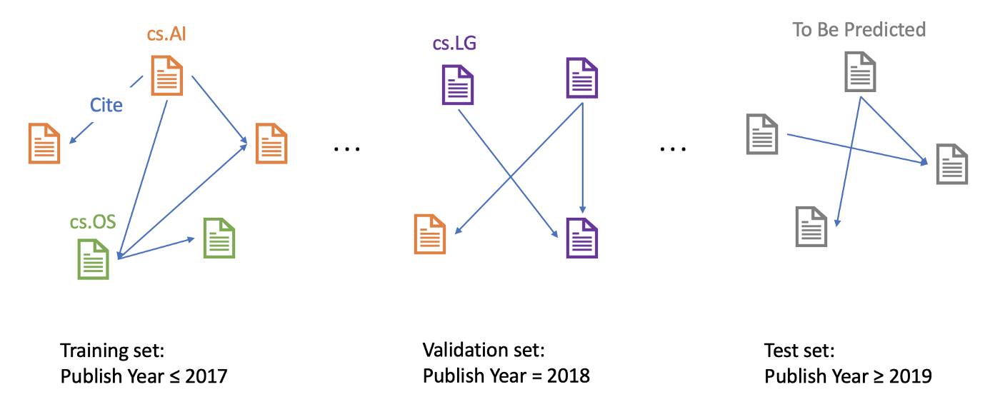

Each paper comes with a feature vector, publication year, title, and abstract. The feature vectors are computed by first calculating the word embeddings over the MAG corpus with the skip-gram model [2] and then averaging over each paper’s title and abstract. The publication years range from 1971 to 2020.

The dataset comes with manually annotated labels and proposes the task of predicting 40 categories of arXiv CS papers, e.g., cs.AI (Artificial Intelligence), cs.LG (Machine Learning), cs.OS (Operating Systems). The metric is classification accuracy.

Given the goal of predicting recent papers’ areas based on historical data, papers published until 2017 are used for training, while those published in 2018 are used for validating and those published since 2019 are for testing.

# GAT (Graph Attention Network)

As a classical Graph Neural Network (GNN)[3], Graph Attention Network (GAT) [4] can be decomposed into two components as other GNNs: (1) Message (2) Aggregation. Initially, each node is assigned a node feature, which in our dataset is the paper’s feature vector. In a network that consists *L* GNN layers, at each layer *l* (*1, 2, …, L*), each node first calculates its own “message” with a message function, and then every node updates its node feature by aggregating the “messages” from all its neighbor nodes as well as itself. The Message and Aggregation steps can be concluded as below:

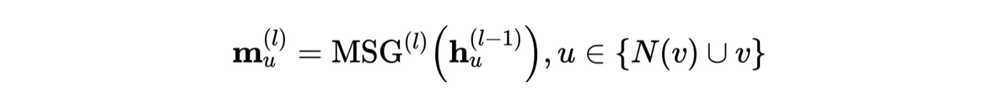

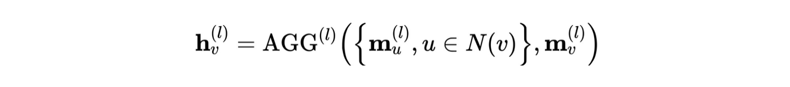

GAT, in addition, applies an extra self-attention mechanism to GNN. At the Aggregation step, the “message” of neighbor nodes are aggregated with respect to an “attention score”. For a central node *A* and one of its neighbor node *B*, an attention score *α* between *A* and *B* is computed and it determines the “weight” of neighbor node *B*’s “message” when central node *A* is doing Aggregation.

This attention score can be seen as a factor of importance. As supposed to the average aggregation where the weights are all *1/N* (where *N* denotes the number of neighbors node *A* has), *α* of *A* and *B* can be higher or lower than *1/N*, indicating a larger or smaller impact that the neighbor node *B* has on the central node *A*.

The number of *α* is computed by taking the node features of central nodes and neighbor nodes, and doing a sequence of transforms as below (here *i* corresponds to node *A*, and *j* corresponds to node *B*)

![i is the central node, j is i’s neighbor node. W is a parameter matrix. a is a mechanism [4]](../images/1*b_4tis5cRqoPVGCIPXM2BA.png)

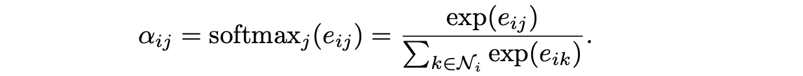

By using a single-layer feedforward neural network as the mechanism *a*, and applying the LeakyReLU nonlinearity, we have the expression for $α$:

![a is a parameter vector, W is a parameter matrix [4]](../images/1*8UmW43ZkomrEJ_udbEZrzw.png)

Without loss of generality, we could draw an example of the neighborhood of node *A*:

And then the computation of attention scores can be visualized as:

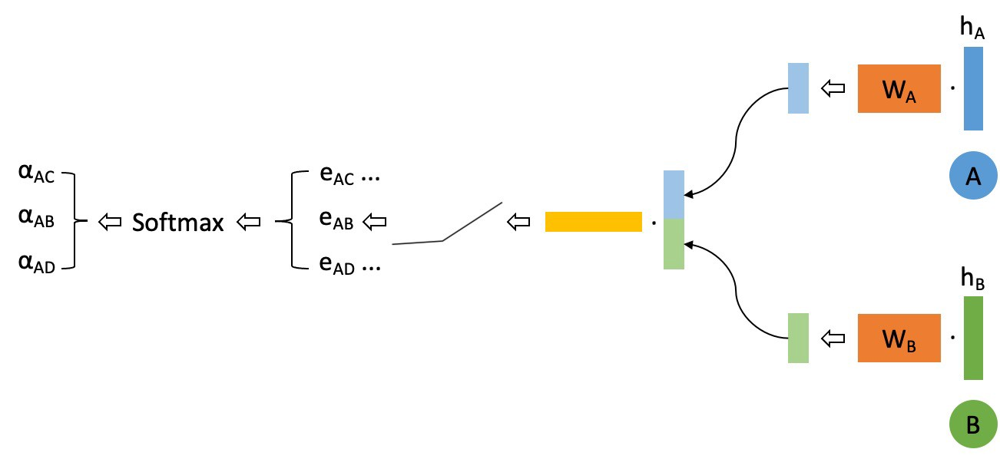

We further adopt multi-head attention [5] to stabilize the learning process of self-attention. We use *K* independent attention mechanisms (or “heads”) to separately compute the updated node feature representations and then concatenate these representations. Assume we are using a Two-Head Attention, an example aggregation process will look like below, where the solid line and dotted line correspond to two different attention “head”, and the width of lines indicate attention scores.

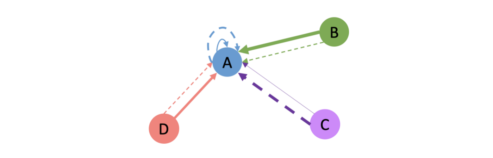

The base model pipeline we applied is shown below.

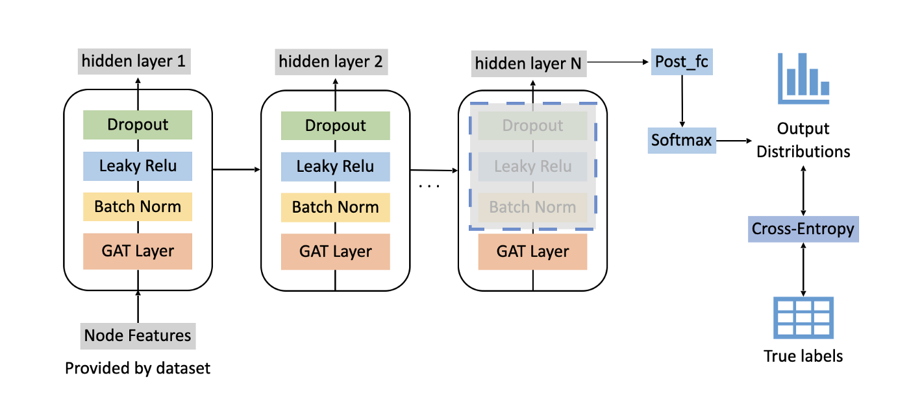

# Tricks

Upon the base GAT model, we also added several tricks that were found useful in GNNs. It’s helpful to know about these commonly used tricks, and when you’re building a GNN of your own, give them a try and they might boost your model’s performance. We will walk you through these tricks and introduce their effect on the overall performance later.

## Enrich node features with Node2Vec embeddings

Node features provided by the dataset itself do not contain information about the graph structure. Therefore, it sounds like a good idea to enrich the node features with structural knowledge. Node2Vec is a popular method to learn node features from the graph structure without the use of any external supervision [6].

Through simulating biased random walks, Node2Vec learns multi-hop neighborhood structure effectively. As Node2Vec is not the main focus of this tutorial, we will stop here and leave interested readers to the [Node2Vec](https://arxiv.org/abs/1607.00653) paper.

![Random walk of different styles [6]](../images/1*7m2BR6FA6tR3niv5j6uhiw.png)

We directly leverage Node2Vec implemented in PyTorch Geometric to train the embeddings. For implementation details, you can read the source code of [Node2Vec in PyTorch Geometric](https://pytorch-geometric.readthedocs.io/en/latest/_modules/torch_geometric/nn/models/node2vec.html).

To use the learned features (vectors of length 128), we concatenate them with the node features provided by the dataset (also vectors of length 128) and feed them into the network.

Here’s a code snippet showing our implementation of Node2Vec:

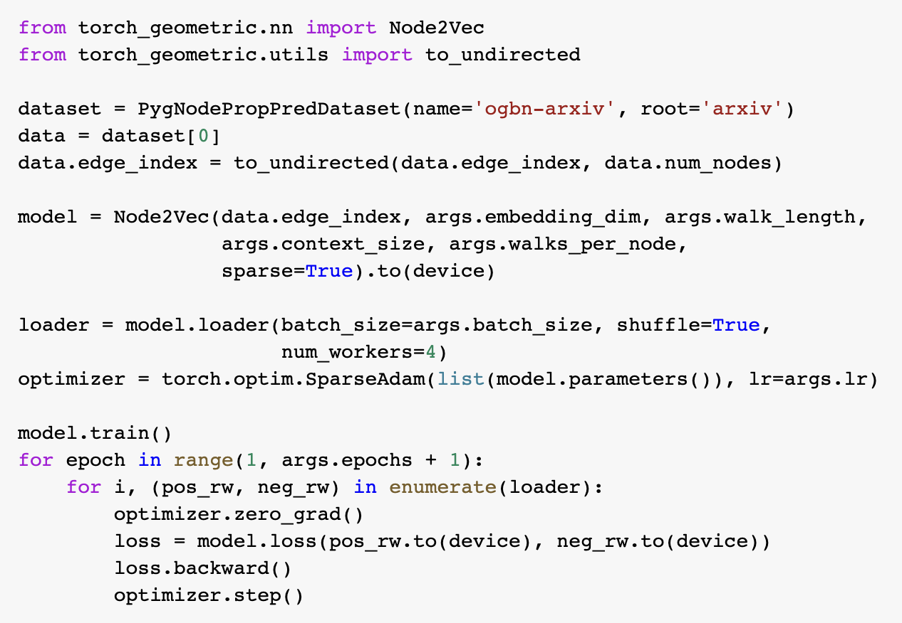

## GAT Variant

GAT is a classical network structure for GNN, and there have been some variants. Bag of tricks [7] borrowed the idea from Graph Convolutional Network (GCN) [8] with *Symmetric Normalized Adjacency Matrix* and applied it to GAT.

Say we write the update rules of traditional GAT in matrix form (for simplicity, we discuss the single-head attention scenario):

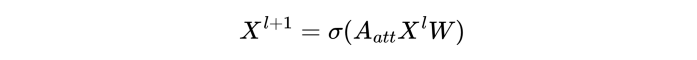

For clarity we write down the definition of the attention matrix:

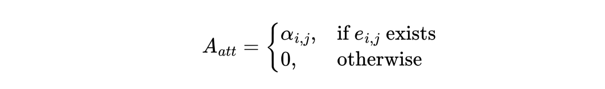

Then Bag of tricks added a residual block to the layer and also normalized the attention matrix:

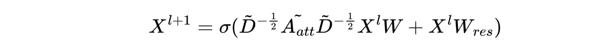

Where:

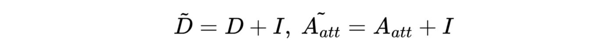

In order words, we first add self-loops to the graph and then calculate the [degree matrix](https://en.wikipedia.org/wiki/Degree_matrix) (*D*) and attention matrix. (By default, *A* and *D* do not contain self-loops)

To implement the GAT variant, we create a class inherited from PyTorch Geometric’s GATConv and rewrite the forward function, as shown in the code snippet below.

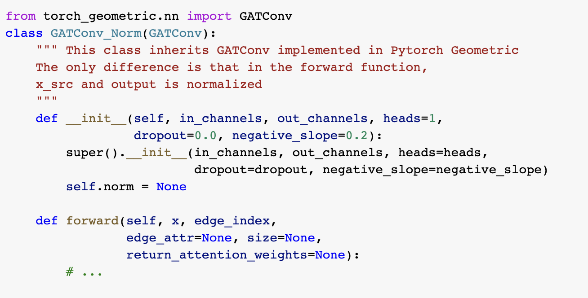

## Label Usage

In the node classification task, we have access to some nodes’ ground-truth labels and need to predict unknown nodes. Label Usage [7] is a popular trick which explicitly uses label information when predicting the test node labels.

Label usage is a data augmentation method. By leveraging the information of labels, the classifier could gather more correct information during the training process. When the training accuracy is below 100%, the label information of the misclassified samples is not contained in the model, despite the fact that they can provide additional information. At the same time, these misclassified samples could further mislead its neighbor, so adding correct information in the training process is very important.

In the label usage algorithm,$ f_θ $ denotes the GNN. We concatenate the input feature and the one-hot ground truth vector together as the input (if no ground truth, then the one-hot vector is replaced by an all-zero vector). After getting the predicted outputs (soft labels), we assigned these soft labels to unlabelled nodes.

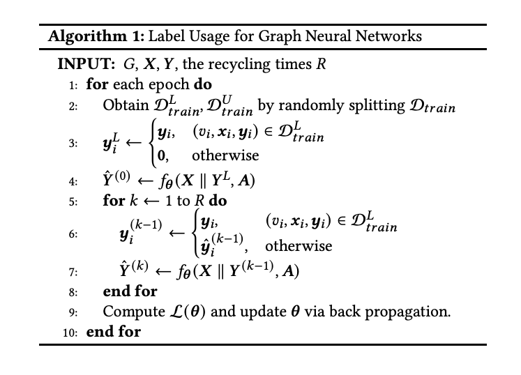

## Correct and Smooth

Correct and Smooth[9] (C&S) is a recent state-of-the-art classification method, which uses the graph structure to do post-processing. It follows three steps:

1. Train a base predictor and use it to predict soft labels for all nodes.

The base predictor could be any type of model that generates a soft label for each node. For example, in our task, we choose GAT as our base model to classify arXiv papers.

2. Correct step:

In this step, we calculate the training residual, which is the difference between a ground-truth label and the predicted soft label. If a node doesn’t have a label (which means it is in the test set), the residual is a zero vector. Then we diffuse the training residual along with the graph structure. The diffusion step will use the following formula:

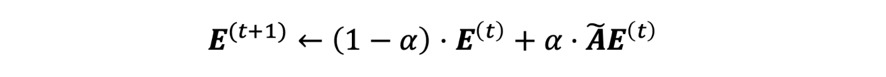

The output of the correct step is a combination of soft label and diffused error.

Here’s a GIF to illustrate the correct step:

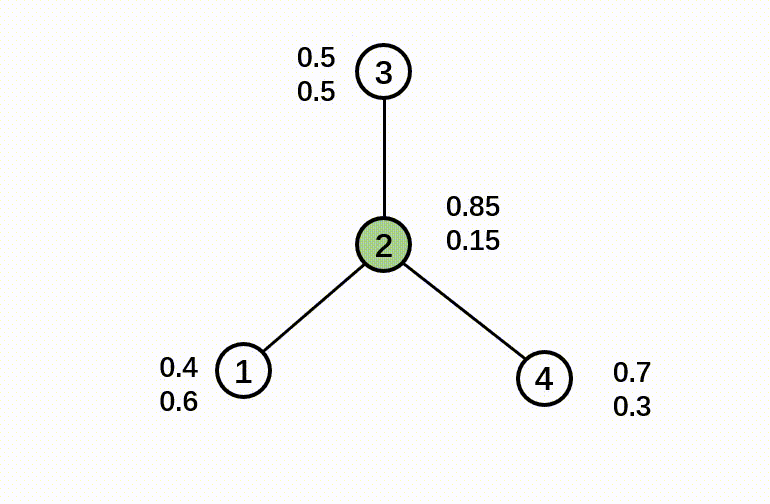

3. Smooth step:

In the smooth step, we use the ground-truth label and output of the correct step as input. Then it diffuses the label along with the graph structure. The label diffusion process can be described with the following formula:

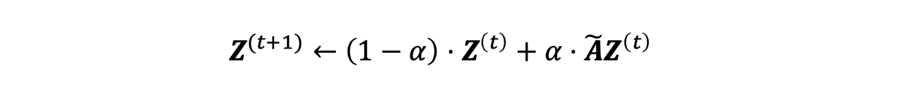

Here’s a GIF to illustrate the smooth step:

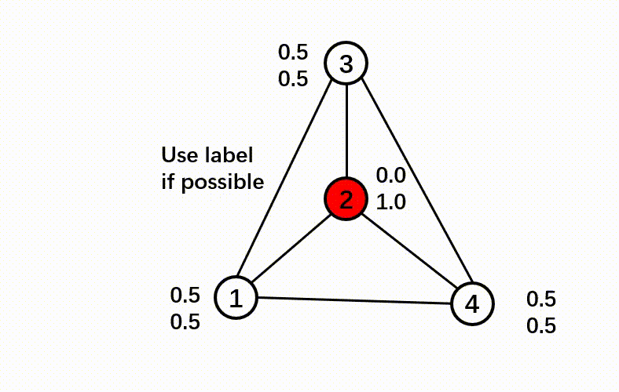

Here is a pipeline showing the C&S post-processing method.

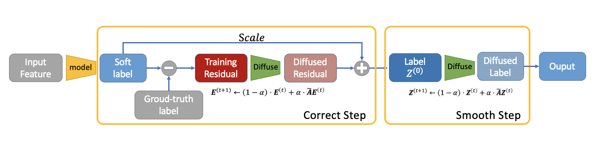

Please refer to the code snippet for implement details:

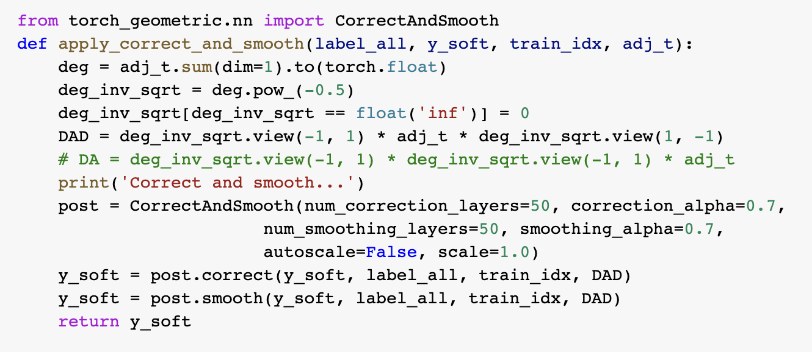

--------

Let’s take a break here and see how far we’ve got! Till now, our base model has added 4 tricks (add node2vec embeddings, modify GAT architecture, label usage, C&S). The current pipeline of our model is shown below. The orange box represents the modification of the GAT model, the yellow box represents adding node2vec embeddings, the green box represents label usage, and the blue box represents C&S.

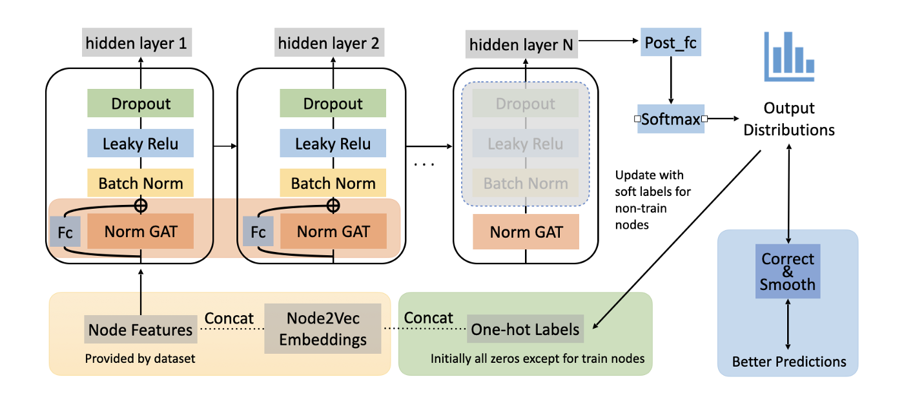

-----------

## Self-KD

Knowledge Distillation (KD) is a model compression method in which a small model is trained to mimic a pre-trained, larger model (or ensemble of models). A common approach is to induce an extra loss with the predictions from a stronger model as labels. Self-KD is a trick that originated from the idea of KD. Sometimes, if we first train a model and then use it as the teacher model to train a second model in a KD fashion, the second model would perform better.

Below is an illustration of our complete model after adding all the tricks we mentioned above. And let’s get started on the experiments!

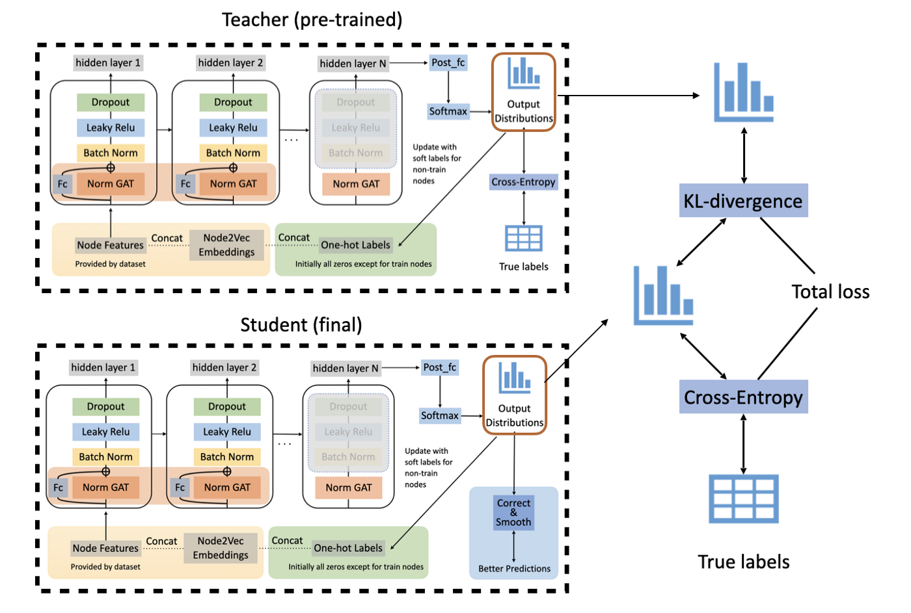

# Experiments

We use [PyTorch](https://pytorch.org/) and the [PyTorch Geometric](https://pytorch-geometric.readthedocs.io/en/latest/) library to implement our model and train it with Google Colab. We keep our model structure, learning schedule, etc., mostly the same as the setting of [10], though due to memory constraint we have to reduce the hidden layer size of GAT.

## Training Process

One example training process is shown in the following picture. During the training process, the training loss gradually decreases, while the test accuracy fluctuates. The test accuracy of this example training process is about 0.73. Compared to the top methods on the [OGB leaderboard](https://ogb.stanford.edu/docs/leader_nodeprop/#ogbn-arxiv) with the same dataset, our model achieves similar high accuracy.

We further visualized the training process on the GAT model in the first 500 epochs. After using [t-SNE](https://lvdmaaten.github.io/tsne/), a technique for dimensionality reduction, to map the embedding to 2-dimensional space, the GIF shows how the hidden embedding after the first GAT layer changes during the training process. The widths of edges show the attention scores in GAT. From epoch 0 to epoch 499, the nodes belonging to the same class gradually group together. At the same time, the attention mechanism generates some important attention edges during this process.

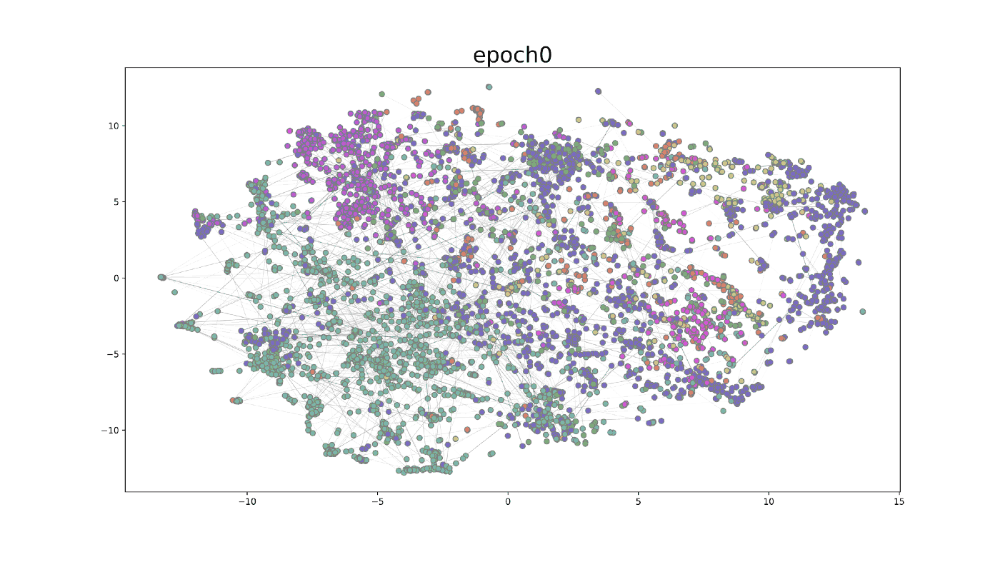

# Results

We designed our experiments in an incremental way. In the chart below, every row consists of one more trick of the previous row, while the first row is the GAT baseline setting with no bells and whistles.

Our experimental results are shown in the table.

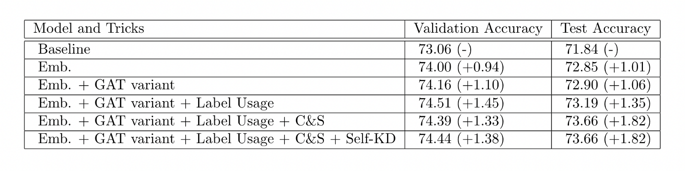

The comparison of different models can also be seen clearly in the figure below.

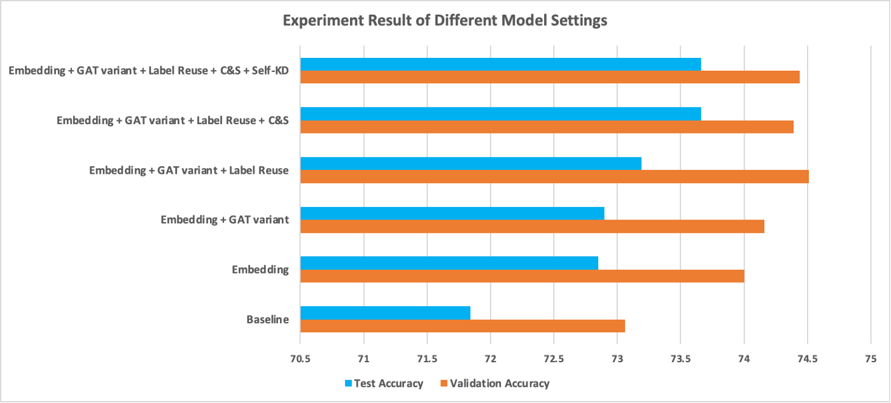

We can observe that:

- Training with Node2Vec embeddings improves both validation accuracy and test accuracy by about 1 point. Though not shown in this chart, the training process also converged noticeably faster.
- Adding residual connections and normalizing the attention matrix together brought tiny improvement. Since we only used 3 layers of GAT, residual connections may not be as useful as they are in deep models.
- Label usage and C&S further boosted the performance by 0.3% and 0.5%, respectively. These two tricks both involve leveraging ground truth labels, and they may have similar effects on the learning process — using neighbors with ground truth to guide prediction.
- At last, experiments show self-KD brought no performance gain. We must point out that, averaging the outcome of 5 runs is still not statistically stable enough to claim that self-KD is not helpful in our setting, but chances are high that they are not as significant as other tricks.

**The final result compared to leaderboard data:**

Our results are lower than the numbers on the leaderboard (~0.5%), probably because of two reasons:

- The author used one V100 GPU for training, which supports more parameters in the hidden layer of GAT (64 v.s. 256)
- Randomness

# Conclusion

In this blog, we reproduced the work of [10] and deliver a thorough introduction and analysis. In detail, we implemented the Graph Attention Network [4] and several commonly used tricks to challenge the node classification task on the ogbn-arxiv dataset. Our experiments show satisfactory results on this dataset. At the same time, we explored the effectiveness of different tricks proposed or introduced in the paper. From our experiments, we found that Node2Vec embeddings, label usage, and C&S achieved noticeable improvements on the task while changing the network structure of GAT and leveraging self-KD barely increases the accuracy.

Going from top to bottom of the ogbn-arxiv leaderboard we can observe an interesting fact: leading methods use a bunch of tricks. Tricks may not bring consistent gain across all tasks, but if you are not satisfied with your model, just give them a try and wait for a surprise!

# References

1. Wang, K., Shen, Z., Huang, C., Wu, C.-H., Dong, Y., & Kanakia, A. (2020). Microsoft Academic Graph: When experts are not enough. *Quantitative Science Studies*, *1*(1), 396–413. https://doi.org/10.1162/qss_a_00021
2. Mikolov, T., Sutskever, I., Chen, K., Corrado, G. S. & Dean, J. (2013). Distributed Representations of Words and Phrases and their Compositionality. In *NIPS* (pp. 3111–3119) . Curran Associates, Inc. .
3. Scarselli, F., Gori, M., Ah Chung Tsoi, Hagenbuchner, M., & Monfardini, G. (2009). The Graph Neural Network Model. *IEEE Transactions on Neural Networks*, *20*(1), 61–80. https://doi.org/10.1109/tnn.2008.2005605‌
4. Veličković, P., Cucurull, G., Casanova, A., Romero, A., Liò, P. & Bengio, Y. (2017). Graph Attention Networks. *ICLR 2018*, .
5. Vaswani, A., Shazeer, N., Parmar, N., Uszkoreit, J., Jones, L., Gomez, A. N., Kaiser, Ł. & Polosukhin, I. (2017). Attention is All you Need. In I. Guyon, U. V. Luxburg, S. Bengio, H. Wallach, R. Fergus, S. Vishwanathan & R. Garnett (ed.), *Advances in Neural Information Processing Systems 30* (pp. 5998–6008) . Curran Associates, Inc. .
6. Grover, A. & Leskovec, J. (2016). node2vec: Scalable Feature Learning for Networks.. *CoRR*, abs/1607.00653.
7. Wang, Y., Jin, J., Zhang, W., Yu, Y., Zhang, Z., & Wipf, D. (2021). Bag of Tricks for Node Classification with Graph Neural Networks. *arXiv preprint arXiv:2103.13355*.
8. Kipf, T. N. & Welling, M. (2016). Semi-Supervised Classification with Graph Convolutional Networks. *5th International Conference on Learning Representations*.
9. Huang, Q., He, H., Singh, A., Lim, S. N., & Benson, A. R. (2020). Combining label propagation and simple models out-performs graph neural networks. *arXiv preprint arXiv:2010.13993*.
10. Chi, H., Wang, Y., Hao, Q., & Xia, H. (2021). Residual Network and Embedding Usage: New Tricks of Node Classification with Graph Convolutional Networks. *arXiv preprint arXiv:2105.08330*.

