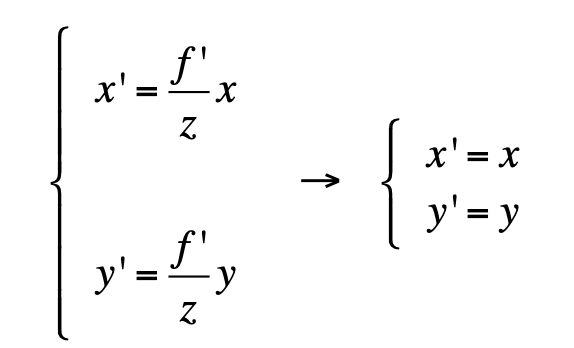
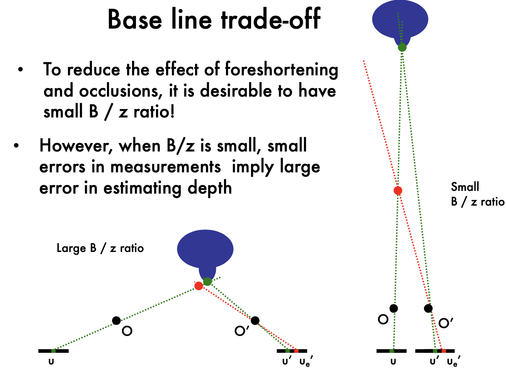
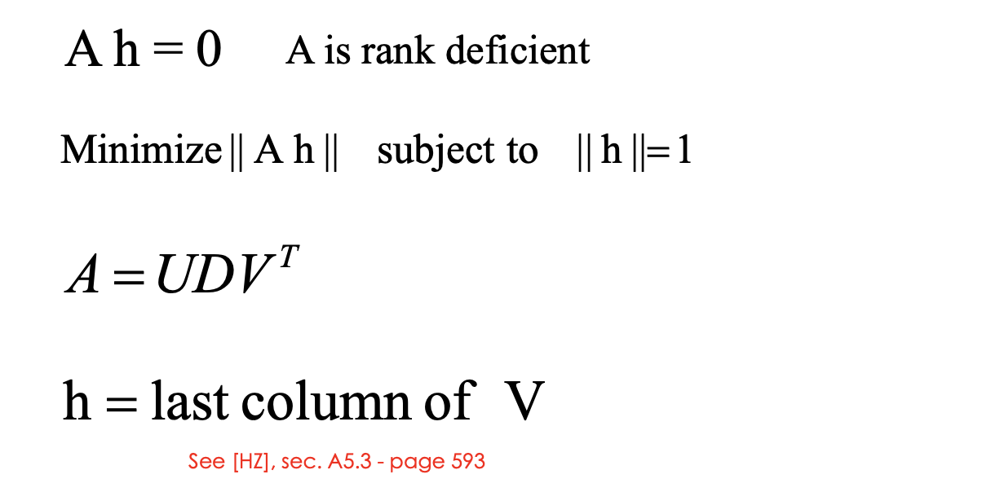

# CS231A Lecture Notes

## Lec2 Camera Model

### Pinhole cameras & lenses

- Pinhole Camera:

  - Aperture is too large: blur picture

  - Aperture too small: not enough lights

- Cameras & lens

  - a sepcific distance to ???

  - all rays of light that are emitted by some point P are refracted by the lens such that they converge to a single point P ′

  - 

    - all the x, x' are in camera reference system

  - Radial Distortion:

    - noticebale for rays that apss throught the edge of the lens

  - Is the projective transformation correspond to what we see in actural digital images: No

    - points in the digital images are, in general, in a different reference system than those in the image plane.

    - digital images are divided into discrete pixels

      - 

    - the physical sensors can introduce non-linearity such as

      distortion to the mapping. 

- Euclidian:

  - projective transformation is non-linear in Euclidian Space
  - can not express in matrix form

- Homogeneous coordinate system

  - add one dimension at the last dimension
  - projective transformation is linear
  - Projective transformation - Intrinsic matrix
    - 
    - Add camera Skewness: 5DoF
    - 

### The geometry of pinhole camera

- World reference system (Appendix A) - Extrin

  - Translation in Homogeneous Coordinate: (2D)
    

  - R: rotation

    - Euclidean: 
      
    - 

  - S: scaling in Homogenous Coordinate (2D), 1 DOF

    

    - 3D rotation: 3 DOF. dimension: 3 (for 3D point; For 2d point, the dimension of R is 1) We can rotate around x, y, z axes
      

    

- World reference system => Camera reference system

  - R: totation
  - T: translation
  - 

- R, T extrinsic parameteres, only related to exteranl coordinate system

  - K, intrinsic parameter: only about the camera system
    - 5 dimensions of K: alpha, beta, Cx, Cy, theta

- Projective transformation:

  - M's dimension: 11
    - K =5, R=3, T=3 , total 11

- Projection properties

  - point to point
  - lines to lines
    - for fish cameras, it's not true. line to skews
  - distant objects look smaller
    - length diviede by z (z is the depth/distance)
    - parallel lines intersect in the image at vanising point
    - Horizon line (vanishing line) is always a straight line

- Canonical Projective transformation

  - 

## Lec3 Camare Model2 & Camera Calibration

- Recap:
  - 
  - Exercise: In homogeneous system: If the coordinate of world system and camera system is the same: [R T] = [I 0]
    - Assume caemra model as a focal length, zero skewness,  no offset, and pixel are squrae:
    - (no skew, no offset,)

  - K, camera matrix:

- Weak perspective projection
  - remove non-linearity
  - When the relative scene depth is small conpared to its distance z_o form the camera
  - reference plane: can be assigned to any $z_o$
  - in Euclidan, the $P'_E$ simplified 
  - 

- Orthographic projection:
  - the optical center is located at infinity
- Pros and cons:
  - weak perspective is much simpler, useful for recongnition
  - Pinhole perspective is acurate, useful for SLAM

- 

### Camera Calibration 

- Calibration:

  - Estimate intrinsic and extrinsic parameteres from 1 or multiple images 
  - Calibration rig: a typical rig is a cube. The corner is the original point of world reference system
  - 11 unknow parameters, at least 6 corresponding point pairs (each point has 2 equations)
    - 
  - P is homogenous coordinates
  - Solve by SVD:
    - 
    - 
  - Degenerate case:  all the point pairs should **NOT** belongs to a line or even a plane; 
    - Points cannot lie on the intersection curve of two quadric surfaces
  - Use $\rho$ to correct scale issue (the matrix is up to scale)
    - 

- Handling distortions 

  - start by solving linear problem ($\lambda = 1$)

  - Another method: estimate m1 and m2 and ignore $\lambda$

    -  the slope is constant: u_i / v_i
    -  first solve m1 and m2, then compute m3

  - Radial Distortion:

    - 
    - Not a linear system

  - Solve: use slope

    

## Lec4 Single View Metrology

- Can I estimate P form the measurement p from a single image?
  - We only know P is on the red line, but we do not know where P is.
  - Can not map from 2D to 3D
- Transformation in 2D

  - Isometry: concate of rotation and translation
    - disscuse in homogenous space
    - preserve distance (areas)
    - Rotation + Transformation
    - DOF =3, degree of freedom (rotation:1, translation: 2)
  - Similarity: 
    - Unifom Scale, Rotation, translation
      
    - DOF = 4 (rotation:1, translation: 2, scale:1)
    - preserve the ratio of length
  - Affine:
    - 
    - 
    - First rotate $\phi$, then scale, then rotate back ,then rotate $\theta$
    - D: anisotropic scaling
    - Preserve parallel lines, 
    - DOF: 6 (4 from matrix A, 2 from D)
  - Projective transformation:
    - 
    - 8 DOF ???

### Vanishing points and lines

- l: [a b c] (in 2D)
- x belongs to l, $x^Tl = 0$
- intersecting lines: $x = l \times l'$

- Points at infinity: [x1, x2, 0]

- lines in 2D plane
  - lines infinity: [0 0 1]
  - Points and lines at infinity:
    - Projective transformation of a point at infinity 
      
    - apply H for p_infinity: 
      - is it a point at infinity? No
      - A is 2\*2, v is a vector (1* 2 vector) to capture project ???, b does not matter
      - when v=0, it is a point at infinity [Px, Py, 0]
    - Apply affine transformation: still a point at infinity
  - Projective transforamtion of a line:
    - when H= HA, its a line at infinity
- planes and points in 3D:
  - $x \in \Pi$, $x^T\Pi = 0$ 
- lines in 3D: 
  - Vanishing points
    -  yes
    - M = K [R t] maps point in 3D into image, p = Mx
    - vanishing point is not at infinity
  - v = Kd
    - K, camera matrix; d, diretion of the line in 3D respect to camera
    - 
- horizontal lines: 
  - 
  - Are these two lines parallel?
    - Recognize the horizon line
      Measure if the 2 lines meet at the horizon 
      if yes, these 2 lines are // in 3D
    - Need to know the intersect point belong to horizontal
    - originate at the same vanishing point -> parallel
- Vanishing points and planes:
  - n, the normal of plane $\Pi$, calculate the normal in camera system
  - 
  - A set of 2 or more lines at infinity defines the plane at infinity $\Pi_{\infin}$
- Angle between 2 vanishing points
  - 
  - Calculate K:
    
  - useful to calibrate the camera; estimate the geometry of the 3D world.

### Estimating geometry from a single image

- A Single View Metrology Example

  - we can measure v1, v2, v3 in image
    
    - using Cholesky factorization to solve K
  - The equations are not sufficient for K, since K has 5 DOF
  - the angle of each pair of plains is 90 (knowledge). If we do not have the knowledge, we can have ML methods
  - with simplified camera model, we can calculate $ \omega$ using 3 points
  - normal n is in the camera coordinate system
    - calculate normal n => reconstruction from single view
    - the actual scale of the scene is NOT recovered

## Lec5 Epipolar Geometry

- Epipolar Genometry = multi-view geometry

- 

  - Intrinsic ambiguity of the mapping from 3D to image (2D)

- Two eyes help - Triangulation

  - cross product of two line => intersection point, in homogenous system
  - If there are some noise, the lines won't intersect
    - find minimizes: 

- Triangulation:

  - P* is the estimation of actual P (P in 3D)
  - Do not need to calculate the line in 3D, which is hard to do

- Multi-view genometry

  - in this lecture, we suppose the corresponding p and p' is given
    

  - the line connect O1 and O2 is called baseline

  - Epipolar lines: blue lines, p'e' and pe

  - Epipoles: e, e'

    - = intersections of baseline with image planes

      = projections of the other camera center

  - Can we know where is p'?

    - p' must be on epipolar line
    - p' is no longer on the arbirarly position of the line

  - camera is  canonical:

    - K is identity matrix (K is the camera intrincs)

- Epipolar Constraint:

  - Essential Matrix
  - 
    -  p' is at the second camera reference system
  - 
  - 
    - $l'$ is defined by p' and the base line, so $l$ must be associate with p'
    - E has 5 DOF: **E is up to scale**, and T has 3 DOF, and R has 3 DOF

- Cross product to matrix:

  - 

- Fundamental Matrix:

  - Esstential matrix is derived using canonical cameras assumption. Fundamental matrix does NOT have this assumption
  - 
  - 
  - can also be calcualted according to just observations
  - F gives constrains on how the scene changes under view point transformations

- Estimating F

  - 8 points algorithm:
    - Step1: 
    - Step2: 
  - What is the problem of 8-points algorithms
    - uv in matrix W may be very large,some item in matrix W can be very small 
    - Highly un-balanced (not well conditioned)
    - Values of W must have similar magnitude
    - This creates problems during the SVD decomposition

- Normalized 8 points 

  - Mean square distance of the image points from origin is ~2 pixels
  - 

## Lec6 Stereo Systems/ Multi-view Geometry

- Essential Matrix

  - camera are caronicol
  - l = Ep
  - pEp' = 0
  - E = [Tx] R

- Fundamental Matrix

  - 

- Parallel image planes:

  - 
  - 
  - 
  - 
  - 
  - Rectification: making two images "parallel"
    - make triangulation easy
    - rectification is a homography (projective transformation)
  - Application: view morphing
    - New views can be synthesized by linear interpolation

- Parallel image planes

  - O1-xyz are attached to the camera
  - p and p' **share same v coordinates** (parallel)
  - Rectification: make any two images parallel, homographic transformation H
    - homographic transformation ??: transfrom a plan to another plane  
  - Inteplate view between two parallel images -> get different views

- Why are parallel images important?

  - Makes triangulation easy - point triangulation

    - disparity = p_u - p_u', propotional to B*f/z

    -  

    - the black points are not shadows, are occlusions(do not how to decided)

      

  - Make the **correspondence problem** easier

    - Correspondence problem

      - p belongs to l = Fp'  => 1 dimensional search problem
      - What's the problem?
        - different lighting?

    - Window-based correlation Methods

      - 

      - nomalize: Changes in the mean and the variance of intensity values in corresponding windows!

        - 

      - Effect of the window size

        - Smaller window

          More detail

          More noise

        - Larger window

          Smoother disparity maps

          Less prone to noise

- Issues of Corresponence problem:

  - Fore shortening effect
  - Oclusions
  - To reduce the effect of foreshortening and occlusions, it is desirable to have small B / z ratio!
  - However, when B/z is small, small errors in measurements imply large error in estimating depth

- Base line trade-off: 

  - Small errors in measure ments imply large error in estimating depth; small B/z ratio brings large triangulation error when measurement error $u_e'$
  - 

- Non-local constraints to help enforce the correspondence

  - Difficult: 

    \- Occlusions
     \- Fore shortening
     \- Baseline trade-off
     \- Homogeneous regions 

    \- Repetitive patterns

  - uniqueness: For any point in one image, there should be at most one matching point in the other image

  - Ordering: Corresponding points should be in the same order in both views

  - Smoothness: Disparity is typically a smooth function of x (except in occluding boundaries)

  

- Multi-view Problem

  - Structure from motion problem (SFM): locolize the location of camera for each image; build 3D points 

- SFM:
  - Affine SFM: Affine structure from motion
    - 
    - 
  - Two approaches: 
    - Algebraic approach (affine epipolar geometry; estimate F; cameras; points) 
    - Factorization method

## Lec7 Multi-view Geometry

### Affine SFM

- Affine Structure-from-Motion Problem

  - 

  

- Factorization method

  - centering each image. 
  - Centering: subtract the centroid of the image points
  - 
  - 
  - 
  - SVD decomposition, and get combination of u and w  is Motion(M),  v is 
  - 
    - Noises
    - Affine approximation

- Problems: Affine Ambiguity

  - The decomposition is not unique. We get the same **D** by applying the transformations: H is arbitrary 3*3 matrix describing an affine transformation

    **M\* = M H **

    **S\* = H** **^-1 S**

  - Need additional constraints

  - The scene is determined by the images only up a **similarity**

    **transformation** (rotation, translation and scaling)

    - The ambiguity exists even for (intrinsically) calibrated cameras
    - For **calibrated cameras**, the similarity ambiguity is the only ambiguity

### Perspective SFM

- From the mxn observations **x_**ij, estimate:

  *m* projection matrices **M**= motion *i*

  *n* 3D points **X**_j = structure

- Perspective SFM

  - 
  - If the cameras are **not calibrated**, cameras and points can only be recovered up to a 4x4 projective (where the 4x4 projective is defined up to scale)
  - projective ambiguity
  - 2mn equations in **11m+3n – 15** unknowns

- Methods:

  - algebraic approach

  - Factorization method - Affine SFM

  - Bundle adjustment

- Algebraic Approach:

  - Compute the fundamental matrix F from two views

    - at least 8 point correspondences, compute F

  - Use F to estimate projective cameras

    - 

    - 
      
    - 
      
    - b is an epipole!

  - Use these cameras to **triangulate** and estimate points in 3D

    - 3D points can be computed from camera matrices via SVD

- Algebraic Approach: the N-views case

  - Pairwise solutions may be combined together using *bundle adjustment*

- Bundle adjustment 

  - 

  - limitations of previous methods:

    - **Factorization methods** assume all points are visible. This not true if:

      • occlusions occur
       • failure in establishing correspondences

    - **Algebraic methods** work with 2 views

  - 

  - Use Levenberge-Marquardt Algorithm to minimize

  - Advantages:

    - handle large number of views
    - Handle missing data

- Self-calibartion

  - the problem of <u>recovering the metric reconstruction</u> from the perspective (or affine) reconstruction
  - Several approaches:
    - \-  Use single-view metrology constraints (lecture 4)
    - \-  Direct approach (Kruppa Eqs) for 2 views
    - \-  Algebraic approach
    - \-  Stratified approach
  - Inject information about the camera during the bundle adjustment optimization

  - For calibrated cameras, the similarity ambiguity is the only ambiguity
  - 
    Projective reconstruction => affine reconstruction (up to affinity) => similarity reconstruction (up to scale)

- 

## Lec8 Active stereo & Volumetric stereo

- Traditional Stereo
  - Main problem: need to find correspondence
- Replace one of the two cameras by a projector
  - Projector geometry calibrated
  - What’s the advantage of having the projector? Correspondence problem solved!
  - Projector and camera are parallel
- Laser Scanning:
  -  Optical triangulation
    - Project a single stripe of laser light
    - Scan it across the surface of the object
    - This is a very precise version of structured light scanning
  - Cons:
    - slow
    -  Cannot capture deformations in time
- Active stereo
  - \- Dense reconstruction
     \- Correspondence problem again
     \- Get around it by using color codes

- Depth sensing
  - Infrared laser projector combined with a CMOS sensor

- Volumetric stereo:
  - 
  - 

- Contours / silhouettes 

  - silhouette is defined as the area enclosed by the apparent contours

  - Using contours/silhouettes in volumetric stereo, also called

    **space carving**

  - How to use Contours: visual hull / visual corn

  - **Consistency:**
     A voxel must be projected into a silhouette in each image

  - Space carving complexity: O(n3)

    - use Octrees to speedup
    - 

  - pros and cons:

    - Robust and simple
    - No need to solve for correspondences
    - Produce conservative estimates
    - cons: Accuracy function of number of views
    - cons: Concavities are not modeled 

- Space Carving:

  - use contours / silhouettes 

- Shadow Carving

  - Self-shadows are visual cues for shape recovery

  - Camera + array of lights
  - 
  - Summary:
    - Produces a **conservative** volume estimate
    - Accuracy depending on view point and light source number 
    - Limitations with reflective & low albedo regions

- Voxel Coloring: use color as consistency test
  - non-unique: multiple consistent scenes
    - how to fix: need to use a visibility constraint
    - if a voxel in two image are consistent, mark the voxel "in"
  - A Critical Assumption: Lambertian Surfaces
    - color is not related to the view point
  - Photo consistency test
    - 
  - Good things
     – Model intrinsic scene colors and texture – No assumptions on scene topology
  - Limitations:
     – Constrained camera positions – Lambertian assumption

## Lec9 Fitting and Matching

- Fitting
  - Choose a **parametric** model to fit a certain quantity from data
  - Estimatemodelparameters
  - Critical issues: 
    - noisy data
    - outliers
    - missing data (occlusion)
    - Intra-class variation
  - Techniques:
    - least square methods
    - RANSAC
    - Hough Transform
    - EM (Expectation Maximization)
- Least square methods:
  - 
  - h: the parameter of the model
  - using calculus to solve 
  - Issue: fails completely for vertical lines, m is infinity
  - Another way:
    - 
    - 
      - rank deficient means a lot of solutions, not unique. Need an optimal solution
      - using SVD to solve: last column of V correspond to the smallest singluar value
    - Limitations: Robustness to noise is not good

- RANSAC (RANdom SAmple Consensus)

  - Data elements are used to vote for one (or multiple) models
  - verify for a given model, see whether a good fit
  - **Assumption 1**: Noisy data points will not vote consistently for any single model (“few” outliers)
  - **Assumption 2**: There are enough data points to agree on a good model (“few” missing data)
  - $\Pi$ is a fuction, P is a set of all data, I is a set of inlier, O is a set of Outlier
  - Solve for $\Pi$, residual is below threshold
    
    - need to decided threshold before run RANSAC

  - Algorithm:
    

  - How many samples?

    - **N samples are sufficient**

    - N = number of samples required to ensure, with a probability p, that at least one random sample produces an inlier set that is free from “real” outliers

      - want to get rid of outliers

    - number of sample is a function of *s* and *e*: 

      - *e =* outlier ratio (make a guess)

      - s = minimum number of data points needed to fit the model (depend on number of parameters of model)

    - Usually, *p*=0.99

      

  - Good:

    • Simple and easily implementable 
    • Successful in different contexts

  - Bad:

    • Many parameters to tune
    • Trade-off accuracy-vs-time
    • Cannot be used if ratio inliers/outliers is too small

- Hough transforms

  - 

  - all points on x-y plane y =m'x + n' , result a intersection point in m-n plane

  - Issue: The parameter space [m,n] is unbounded...

    - Use a polar representation for the parameter space

  - How to compute the intersection point? In presence of noise!

    - IDEA: introduce a grid a count intersection points in each cell
    - Issue: Grid size needs to be adjusted

  - Good:

    • All points are processed independently, so can cope with occlusion/outliers

    • Some robustness to noise: noise points unlikely to contribute consistently to any single cell

  - Bad:

    • Spurious peaks due to uniform noise

    • Trade-off noise-grid size (hard to find sweet point) 

    • Doesn’t handle well high dimensional models

- Generalized Hough Transform
  - Parameterize a shape by measuring the location of its parts and shape centroid
  - Given a set of measurements, cast a vote in the Hough (parameter) space

- Multi-model Fitting
  - Incremental line fitting
  - Hough transform

- Fitting helps matching
  - 
  - Fitting an homography H (by RANSAC) mapping features from images 1 to 2 
  - Bad matches will be labeled as outliers (hence rejected)!
  - Application: Panoramas

## Lec10 Representations and Representation Learning

- What is a state? What is a representation?
  - Markov Model
  - State
  - control input
  - 
  - State is partial or can not observable
    - ​	
  - Partially observable Markov decision process: Infer state x using observation z
  - eg: 6DOF estimation
  - Use observation go back to the state:
    - Method1, eg: generative observation Model
      - generative model: 𝑧 = h(𝑥)
      - The relationship between x and z: 𝑃(𝑧|𝑥)
      - generate z from x, then compare with ground truth
    - Method2, eg: Discriminative observation Model
      - Discriminative Model: 𝑧 = 𝑔(𝐼)
      - The relationship between x and z: 𝑧 = 𝑥 = h(𝑥)
      - h is filtering, take accumulative information from other frames
      - Traking by decision
- Representation in Computer Vision
- Requirements for Good Representations
  - Compact (minimal)
  - Explanatory (sufficient)
  - Disentangled (independent factors)
  - Hierarchical (feature reuse)
  - Makes subsequent problem easier

- object => representation => Mathematical Model(eg, classifier) => different types
- Traditional Components:
  - Color Histograms
  - Model based Shapes
  - Deformable Part based Models (DPM)
  - Histogram of Gradients (HOG)

- undertanding representations through low-dimensional embeddings
  - t-SNE

- nsupervised Representation Learning
  - Auto-endcoder
    - Reconstruction loss to minimize by finding optimal F

- Representation Learning:

  - **Reinforcement Learning** (Cherry)
     Predicting a scalar reward given once in a while
     A few bits for some samples

  - **Supervised Learning** (Chocolate Coat) 

    Predicting category or vector of scalars per input as provided by human labels. 10-10k bits per sample

  - **Unsupervised / Self-Supervised Learning** (Cake) 

    Predicting parts of observed input or predicting future observations or events Millions of bits per sample

### Summary

- **State:** Quantity that describes the most important aspect of a dynamical system at time t
- **Representation:** data format of input or output including a low-dimensional representation of sensor data
- Learned versus interpretable representations
- Visualize learned representations
- How to learn representations?
  - Supervised
  - Unsupervised
  - Self-supervised
