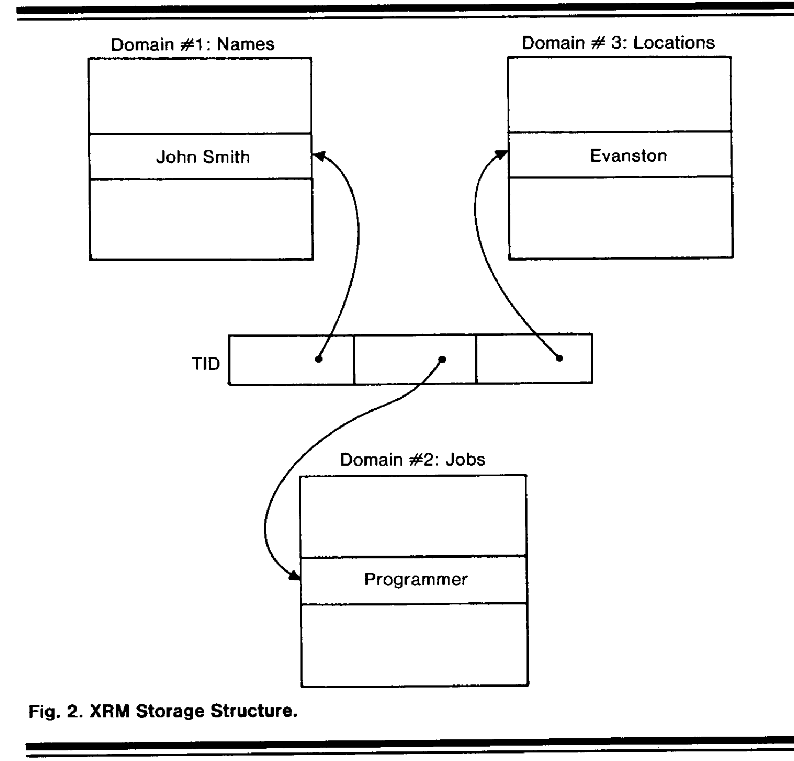
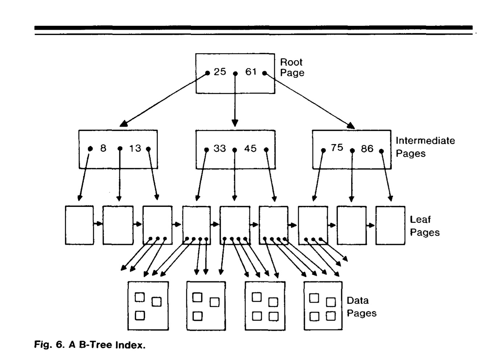

# System R (Reading form CS245)

>  Experimental relational database

- Data independence: relational data model 

- Conventional databse: 

  - store information in two ways:
    - by the contents of record 
  - user algorithms depend on underlying data structure

- Relational Database

  - all information is represneted by data values, never by any sort of connections.
  - The system supports a very high-level language in which users can frame requests for data withour specifiying algorithms for process the requests.

- goal for System R is :

  - high-level, non-navigational user interface
  - Support different types of data use transcaitions, ad hoc queries, report generation
  - rapidly changing database environment
  - support concurrent users
  - recovering the content of table
  - provide flexible different views of stored data, authroized query

  

### Phase 0

Phase 0: SQL suer interface, one user at a time	

- SQL interpreter

- Relational access method called XRM
- support subquery, but does not support join
- System catalog: the description of the content and structure of the database, should be stored as a set of regular relations in the database itself.
- XRM stores relations in the form of "tuples", has tuple identifier(TID)
  - TID contains a page number, point to the page of a tuple (a tuple of different domains)
  - Each domain may have an inversion => find a list of TIDs of tuples which contain a given value
  - 
- Optimizer algorithms for efficient execution of SQL on top of XRM
  - minimize the **number of tuples** fetched from the database in processing a query
- Important lessons of phase 0:
  - oprimizer should no only consider # tuples, but the cose of creating and manipulating TID lists
  - Cost measure should be number of I/Os. 
    - XRM cons: domains stored separately, more I/O; 
    - XRM pros: if data value are relatively large,  if many tuples are processed internally

### Phase1

- Phase 1: multiuser version, full function

- RSS: an access method (locking, logging functions)

- RDS:  relaitonal data system, runs on top of RSS (access path selection)

- UFI: support stand alone query interface

- Compliation Approach

  - compile SQL tinto compact, efficient routines
  - PL/I and Cobol programis run through preprocessor: **exam, optimize, compile**
    - UFI dialog: preprocess, then executed immediately
  - Access model: small, efficient machine-language routing, invoked to perform interaction with RSS
  - All access path selection decision is make in preprocessing
    - may be invalide, eg, some index was delete. Mark as invalide, recalculate

- RSS Access Paths

  - RSS store data in records variable in length and longer than XRM
  - But, all the data values of a record could be fetched by a single IO
  - RSS provide Indexes
    - B-Tree
    - 
  - RSS provide links: pointers points to another related records
  - Access path made available include:
    - index scans
    - relation scans: scan over table and physical storage
    - link scans
  - RSS provide  sorting mechanism

- Optimizer:

  - optimizer chooses to scan each table in the SQL query by means of only one index
  - Highly selectvie index: large ratio of distinct key values to total entries
  - Join Methods:
    - Scan over the qualifying rows of table A, for each row, fetch the matching rouw of table B (offen B have an index)
    - Sort the qualifying rows of tables A and B in order by their respective join fields

- Views and Authorization:

  - allow any SQL query to be used as the definition of a view.
  - When an SQL operation is to be executed against a view, the parse tree which defines the operation is merged with the parse tree which defines the view
  - `GRANT` and `REVOKE` : authorization

- Recovery Subsystem

  - Provision of a means whereby the database may be revocered to a consistent state in the event of failure
  - A consistent state is defined as one in which the data- base does not reflect any updates made by transactions which did not complete successfully
  - Failure types:
    - Media fail: database information on disk is lost
      - an image dump of the database plus a log of before and after changes provide the alternative copy which makes recovery possible
      - use dual logs, recover from log media failures
    - System failure: information in main memory is lost:
      - System R uses the change log mentioned above plus "shadow pages"
      - As each page in the database is updated, the page is written out in a new place on disk, and the original page is retained. 
      - a "checkpoint" occurs in which all updates are forced out to disk, the "old" pages are discarded, and the "new" pages become "old.
      - the system reverts to the "old" pages, and then uses the log to redo all committed transactions and to undo all updates made by incomplete transactions
    - Transaction failure: undo all the changes which have been made by the failing transaction
      - Processes the change log backwards removing all the change smade by the transaction

- Locking system

  - Predictate lock design: abandoned. Lock unit was a data-base property

  - involves a hierarchy of locks, with several different sizes of lockable units, ranging from individual records to several tables

  - When a user accumulates many small locks, they may be "traded" for a larger lockable unit

  - intention lock

  - exclusive lock

    

### Phase2

- Phase 2: evaluation of system R in actual use
- Increase EXISTS, LIKE, OUTER JOIN
- The compilation approach:
  - advantage of compilation approach: (In short, repetitive transaction)
    - the application program interacts with a small, specially tailored access module rather than with a larger and less efficient general-purpose interpreter pro- gram.
    - Ad hoc queries and precanned transactions being treated in the same way
- Available access paths:
  - B Tree index
  - Not used: Hashing & direct links
    - Already have index, do not need hashing
    - For transactions which retrieve a large set of records, the additional I/Os caused by indexes compared to hashing and links are less important.
- Optimizer:
  - the optimizer searches through a tree of path choices, com- puting estimated costs and pruning the tree until it arrives at a single preferred access path. 
  - cost is defined as a weighted sum of page fetches and RSS calls
  - magnitudes of the predicted costs differed from the measured costs in several cases
  - the optimizer's inability to predict how much data would remain in the system buffers during sorting
- Views and Authroization, particularly beneficial
  - The full query power of SQL is made available for defining new views of data (i.e., any query may be defined as a view
  - The authorization subsys- tem allows each installation of Sys- tem R to choose a "fully centralized policy", "fully uncentralized policy", 

